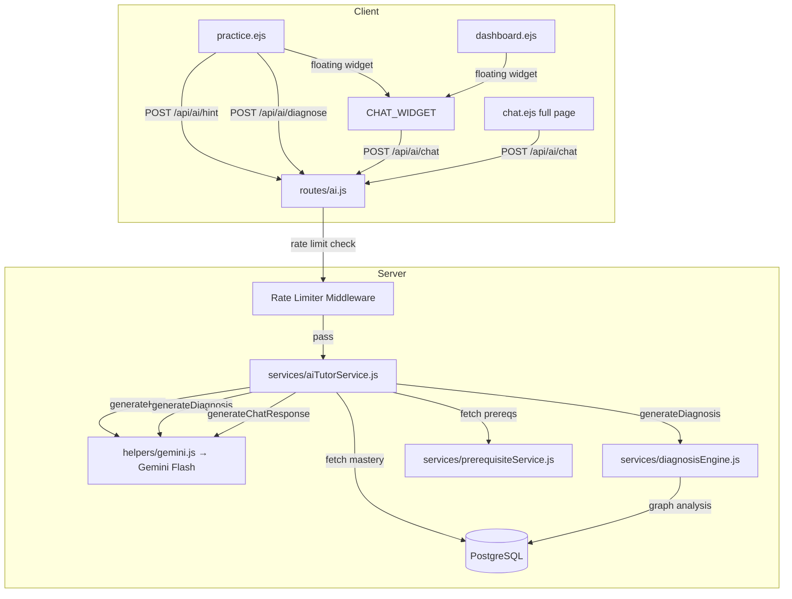

# Design Document: AI Tutor with Gemini

## Overview

This design adds three AI-powered features to Learn.ai using Google Gemini Flash (gemini-2.0-flash), all grounded in the student's real BKT mastery data and prerequisite dependency graph:

1. **BKT-Aware Hints** — When a student answers incorrectly during practice, they can request a personalized hint that explains why their answer is wrong, references their weak prerequisites, and guides them toward understanding without giving away the answer.

2. **AI Prerequisite Diagnosis** — When stagnation is detected (≥5 questions, mastery <0.5), students can ask "Why am I stuck?" and receive a Gemini-narrated explanation of their prerequisite gaps, severity classifications, and a step-by-step study plan with clickable links.

3. **AI Study Plan Chatbot** — A conversational AI tutor accessible via a floating widget (on practice/dashboard pages) or a full-page `/chat` route. The chatbot knows the student's complete mastery profile (all 221 subconcepts), recent practice history, and prerequisite graph structure.

All three features share a common rate limiter (50 Gemini calls/day/student, in-memory) and a consistent UI treatment (typing animations, markdown via marked.js, MathJax re-rendering, glass morphism dark theme).

### Key Design Decisions

- **Single service module** (`services/aiTutorService.js`): All three Gemini interactions live in one file with shared prompt construction helpers. This avoids scattering Gemini logic across routes.
- **Separate route file** (`routes/ai.js`): New `/api/ai/*` endpoints are isolated from existing routes. The existing `/chat` route and `/api/chat` endpoint in `routes/chat.js` will be updated to use the new AI tutor service instead of the Perplexity-based chatService.
- **In-memory rate limiting**: A simple `Map<userId, { count, date }>` resets daily at midnight UTC. No database table needed — acceptable for single-process deployment.
- **Reuse existing helpers**: `helpers/gemini.js` already exports `geminiGenerate(systemPrompt, userPrompt, model)`. The AI tutor service calls this with `gemini-2.0-flash`.
- **Session-based chat history**: Chat conversation history is stored in `req.session.aiChatHistory` (Express session), not persisted to the database. This keeps the implementation simple and matches the requirement.
- **Client-side rendering**: marked.js for markdown, MathJax (already loaded in practice.ejs) for LaTeX, custom typing animation via `requestAnimationFrame`.

## Architecture



### Request Flow

1. Client sends POST to `/api/ai/hint`, `/api/ai/diagnose`, or `/api/ai/chat`
2. `ensureAuthenticated` middleware checks login
3. `aiRateLimiter` middleware checks daily count for `req.user.id`
4. Route handler calls the appropriate `aiTutorService` function
5. Service fetches student context from DB (mastery, prereqs, question data)
6. Service constructs a Gemini prompt with system instruction + user content
7. Service calls `geminiGenerate()` from `helpers/gemini.js` with model `gemini-2.0-flash`
8. Response is returned as JSON to the client
9. Client renders with typing animation → markdown parse → MathJax typeset

## Components and Interfaces

### 1. `services/aiTutorService.js`

The core service module. Three exported functions, plus internal prompt builders.

```javascript
// services/aiTutorService.js
import { geminiGenerate } from '../helpers/gemini.js';
import { getUserConceptMastery } from '../helpers/mastery.js';
import { checkPrerequisiteGaps } from '../services/prerequisiteService.js';
import { diagnosePrerequisites } from '../services/diagnosisEngine.js';
import db from '../config/db.js';

/**
 * Generate a personalized hint for a wrong answer.
 * @param {Object} params
 * @param {number} params.userId
 * @param {number} params.questionId
 * @param {string} params.questionText
 * @param {string} params.option1..option4
 * @param {string} params.correctAnswer - e.g. 'option2'
 * @param {string} params.selectedAnswer - e.g. 'option3'
 * @param {string} params.conceptId
 * @param {string} params.conceptName
 * @returns {Promise<{ hint: string }>}
 */
export async function generateHint(params) { ... }

/**
 * Generate an AI-narrated prerequisite diagnosis.
 * @param {Object} params
 * @param {number} params.userId
 * @param {string} params.conceptId
 * @returns {Promise<{ explanation: string, studyPath: Array, rawDiagnosis: Object }>}
 */
export async function generateDiagnosis(params) { ... }

/**
 * Generate a chat response with full mastery context.
 * @param {Object} params
 * @param {number} params.userId
 * @param {string} params.message
 * @param {Array} params.conversationHistory - [{role, content}]
 * @returns {Promise<{ response: string }>}
 */
export async function generateChatResponse(params) { ... }
```

#### Prompt Templates (Critical)

**Hint System Prompt:**
```
You are a patient, encouraging JEE tutor helping an Indian student preparing for JEE Mains/Advanced.

The student answered a question incorrectly. Your job:
1. Acknowledge their attempt without being condescending
2. Explain WHY their selected answer is wrong — what misconception or error led to it
3. Give a conceptual nudge toward the correct reasoning WITHOUT directly stating the correct answer
4. If the student has weak prerequisites listed below, connect the hint to those gaps
5. Use simple language. If math is needed, use LaTeX with $...$ for inline and $$...$$ for display

Keep the hint concise (3-5 paragraphs max). Use markdown formatting.
Do NOT reveal the correct answer directly. Guide them to figure it out.
```

**Hint User Prompt (constructed dynamically):**
```
**Question:** {questionText}

**Options:**
A) {option1}
B) {option2}
C) {option3}
D) {option4}

**Student selected:** {selectedAnswerText} (WRONG)
**Correct answer:** {correctAnswerText}

**Concept:** {conceptName}
**Student's mastery on this concept:** {masteryPct}%

**Weak prerequisites (mastery < 70%):**
{prereqList — e.g. "- Vectors (42% mastery)\n- Newton's Laws (58% mastery)"}
{or "None — all prerequisites are strong" if empty}
```

**Diagnosis System Prompt:**
```
You are a supportive learning advisor for a JEE preparation student. You have access to a detailed diagnostic analysis of why this student is struggling with a concept.

Your job:
1. Explain in a warm, encouraging tone what specific prerequisite gaps are causing the struggle
2. For each gap, explain WHY it matters for the target concept (cause-and-effect)
3. Provide a clear step-by-step study order based on the recommended path
4. For each step, estimate effort (e.g., "~15 questions to strengthen")
5. End with an encouraging message

Use markdown formatting with headers, bold, and lists. Use LaTeX ($...$) for any math notation.
Classify gaps using these severity labels:
- 🔴 Root Cause: Never attempted or very low mastery, no unmastered prereqs of its own — START HERE
- 🟠 Critical: Below 50% mastery with its own unmastered prereqs
- 🟡 Weak: Between 50-80% mastery, needs reinforcement
- 🔵 Stale: Was mastered but hasn't been practiced recently, at risk of decay
```

**Diagnosis User Prompt (constructed dynamically):**
```
**Target Concept:** {conceptName} ({masteryPct}% mastery)

**Diagnosis Summary:**
- Root causes: {rootCauses.length}
- Critical gaps: {critical.length}
- Stale concepts: {stale.length}
- Weak areas: {weak.length}
- Overall readiness: {overallReadiness}%

**Prerequisite Gaps (ordered by severity):**
{for each gap: "- [{severity emoji}] {name}: {mastery}% mastery, {questionsAnswered} questions answered, confidence {confidence}%, blocks {blocksCount} downstream concepts. Reason: {reason}"}

**Recommended Study Path:**
{for each step: "{i}. {name} ({mastery}% → target 80%) — {reason}"}

{if no gaps: "All prerequisites are mastered. The student needs more practice on the target concept itself. Suggest varied problem-solving strategies and deeper conceptual understanding."}
```

**Chat System Prompt:**
```
You are an AI study tutor for a JEE Mains/Advanced preparation student on the Learn.ai platform. You have access to the student's complete learning profile.

Your capabilities:
- Answer conceptual questions about Physics, Chemistry, and Mathematics
- Recommend what to study next based on their mastery data
- Explain topics at the right level based on their current understanding
- Provide study strategies and exam tips

Rules:
1. Always ground your advice in the student's actual mastery data provided below
2. When recommending topics, reference their specific weak areas
3. Use LaTeX ($...$) for math notation
4. Use markdown for formatting (headers, bold, lists)
5. Be encouraging but honest about areas that need work
6. Keep responses focused and actionable
7. If asked about a topic, check their mastery on related concepts before explaining

**Student Mastery Profile:**
{masteryProfileSummary — grouped by subject, showing weak (<50%), moderate (50-80%), and strong (>80%) concepts}

**Recent Practice (last 20 attempts):**
{recentAttempts — concept name, correct/incorrect, difficulty tier}

**Current Prerequisite Gaps:**
{gapSummary — concepts with mastery < 70% that block other concepts}
```

### 2. `routes/ai.js`

New Express router with three endpoints, all protected by auth + rate limiter.

```javascript
// routes/ai.js
import express from 'express';
import { ensureAuthenticated } from '../middleware/auth.js';
import { aiRateLimiter } from '../middleware/aiRateLimit.js';
import { generateHint, generateDiagnosis, generateChatResponse } from '../services/aiTutorService.js';

const router = express.Router();

// POST /api/ai/hint
router.post('/api/ai/hint', ensureAuthenticated, aiRateLimiter, async (req, res) => {
    // Expects: { questionId, questionText, option1..4, correctAnswer, selectedAnswer, conceptId, conceptName }
    // Returns: { hint: string }
});

// POST /api/ai/diagnose
router.post('/api/ai/diagnose', ensureAuthenticated, aiRateLimiter, async (req, res) => {
    // Expects: { conceptId }
    // Returns: { explanation: string, studyPath: [...], rawDiagnosis: {...} }
});

// POST /api/ai/chat
router.post('/api/ai/chat', ensureAuthenticated, aiRateLimiter, async (req, res) => {
    // Expects: { message }
    // Uses req.session.aiChatHistory for conversation context
    // Returns: { response: string }
});

export default router;
```

**Route mounting in `app.js`:**
```javascript
import aiRoutes from './routes/ai.js';
// ... after other route imports
app.use(aiRoutes);
```

### 3. `middleware/aiRateLimit.js`

Custom in-memory rate limiter keyed by user ID + calendar date (UTC).

```javascript
// middleware/aiRateLimit.js
const DAILY_LIMIT = 50;
const counters = new Map(); // key: `${userId}:${dateStr}` → count

export function aiRateLimiter(req, res, next) {
    const userId = req.user.id;
    const today = new Date().toISOString().slice(0, 10); // 'YYYY-MM-DD' UTC
    const key = `${userId}:${today}`;

    const current = counters.get(key) || 0;
    if (current >= DAILY_LIMIT) {
        return res.status(429).json({
            error: 'Daily AI limit reached',
            message: 'You have used all 50 AI calls for today. Try again tomorrow!',
            remaining: 0
        });
    }

    counters.set(key, current + 1);

    // Cleanup old date keys periodically (every 100 requests)
    if (Math.random() < 0.01) {
        for (const k of counters.keys()) {
            if (!k.endsWith(today)) counters.delete(k);
        }
    }

    // Attach remaining count to response
    res.set('X-AI-Remaining', String(DAILY_LIMIT - current - 1));
    next();
}

export function getAiUsage(userId) {
    const today = new Date().toISOString().slice(0, 10);
    const key = `${userId}:${today}`;
    const used = counters.get(key) || 0;
    return { used, remaining: DAILY_LIMIT - used, limit: DAILY_LIMIT };
}
```

### 4. Practice View Integration (`views/practice.ejs`)

The existing practice.ejs already has a feedback area that shows after answering. We add:

- **"Get AI Hint" button**: Appears in the feedback area when the answer is wrong. Clicking it calls `/api/ai/hint` and renders the response in a collapsible panel below.
- **"Why am I stuck?" button**: Appears when stagnation is detected (the existing `stagnating` flag from the answer response). Clicking it calls `/api/ai/diagnose` and renders the response in a styled card.
- **Floating chat widget**: A fixed-position button (bottom-right) that opens a slide-up chat panel.

```html
<!-- AI Hint Panel (injected into feedback area) -->
<div id="aiHintPanel" class="ai-panel" style="display:none;">
    <div class="ai-panel-header">
        <i class="bi bi-lightbulb"></i> AI Hint
        <button onclick="togglePanel('aiHintPanel')" class="btn-ghost">
            <i class="bi bi-chevron-up"></i>
        </button>
    </div>
    <div id="aiHintContent" class="ai-panel-body">
        <!-- Typing animation renders here -->
    </div>
</div>

<!-- AI Diagnosis Panel -->
<div id="aiDiagnosisPanel" class="ai-panel" style="display:none;">
    <div class="ai-panel-header">
        <i class="bi bi-search"></i> Why Am I Stuck?
    </div>
    <div id="aiDiagnosisContent" class="ai-panel-body">
        <!-- Diagnosis renders here -->
    </div>
</div>
```

### 5. Chat View (`views/chat.ejs`)

The existing `views/chat.ejs` will be updated to:
- Use the new `/api/ai/chat` endpoint instead of `/api/chat`
- Add marked.js for markdown rendering
- Add MathJax for LaTeX rendering
- Add typing animation for AI responses
- Use the Learn.ai theme tokens from `theme.css`

The full-page chat is accessible at `/chat` (existing route in `routes/chat.js` already renders this view).

### 6. Floating Chat Widget

A reusable HTML/CSS/JS snippet included in `practice.ejs` and `dashboard.ejs` via an EJS partial or inline. The widget is a fixed-position button that expands into a 400×600px chat panel on desktop, full-width on mobile.

```html
<!-- Floating Chat Widget -->
<div id="chatWidget" class="chat-widget">
    <button id="chatWidgetToggle" class="chat-widget-toggle" aria-label="Open AI Chat">
        <i class="bi bi-robot"></i>
    </button>
    <div id="chatWidgetPanel" class="chat-widget-panel" style="display:none;">
        <div class="chat-widget-header">
            <span><i class="bi bi-robot"></i> AI Study Tutor</span>
            <button onclick="toggleChatWidget()" class="btn-ghost">
                <i class="bi bi-x-lg"></i>
            </button>
        </div>
        <div id="chatWidgetMessages" class="chat-widget-messages">
            <!-- Messages render here -->
        </div>
        <div class="chat-widget-input">
            <textarea id="chatWidgetInput" placeholder="Ask your AI tutor anything..."
                      rows="1" aria-label="Chat message input"></textarea>
            <button id="chatWidgetSend" aria-label="Send message">
                <i class="bi bi-send"></i>
            </button>
        </div>
    </div>
</div>
```

**Widget CSS (glass morphism, dark theme):**
```css
.chat-widget { position: fixed; bottom: 24px; right: 24px; z-index: 1000; }
.chat-widget-toggle {
    width: 56px; height: 56px; border-radius: 50%;
    background: var(--gradient-purple); border: 2px solid var(--gold);
    color: white; font-size: 1.5rem; cursor: pointer;
    box-shadow: var(--shadow-lg), var(--shadow-glow-purple);
    transition: var(--transition-slow);
}
.chat-widget-toggle:hover { transform: scale(1.1); }
.chat-widget-panel {
    position: absolute; bottom: 70px; right: 0;
    width: 400px; height: 600px;
    background: var(--glass-bg); border: 1px solid var(--glass-border);
    border-radius: var(--radius-xl);
    backdrop-filter: blur(20px); -webkit-backdrop-filter: blur(20px);
    box-shadow: var(--shadow-xl);
    display: flex; flex-direction: column; overflow: hidden;
}
@media (max-width: 768px) {
    .chat-widget-panel {
        position: fixed; inset: 0; width: 100%; height: 100%;
        border-radius: 0; bottom: 0; right: 0;
    }
}
```

### 7. Client-Side AI Response Renderer

Shared JavaScript functions used by both the practice view panels and the chat widget/page:

```javascript
/**
 * Typing animation that reveals text progressively.
 * Uses requestAnimationFrame for smooth 60fps rendering.
 * Reveals ~20 characters per frame.
 */
function typewriterRender(container, fullText, onComplete) {
    let index = 0;
    const charsPerFrame = 20;
    container.innerHTML = '';

    function frame() {
        if (index < fullText.length) {
            index = Math.min(index + charsPerFrame, fullText.length);
            const partial = fullText.substring(0, index);
            container.innerHTML = marked.parse(partial);
            requestAnimationFrame(frame);
        } else {
            container.innerHTML = marked.parse(fullText);
            // Re-render MathJax after typing completes
            if (window.MathJax && MathJax.typesetPromise) {
                MathJax.typesetPromise([container]);
            }
            if (onComplete) onComplete();
        }
    }
    requestAnimationFrame(frame);
}

/**
 * Pulsing skeleton loader for AI loading state.
 */
function showAiLoader(container) {
    container.innerHTML = `
        <div class="ai-loader">
            <div class="ai-loader-text">Your AI tutor is thinking...</div>
            <div class="ai-loader-bar"></div>
        </div>`;
}
```

**CSS for loader:**
```css
.ai-loader { padding: 1rem; }
.ai-loader-text {
    color: var(--text-muted); font-size: 0.85rem;
    margin-bottom: 0.75rem; font-style: italic;
}
.ai-loader-bar {
    height: 4px; border-radius: 2px;
    background: linear-gradient(90deg, var(--purple), var(--gold), var(--purple));
    background-size: 200% 100%;
    animation: shimmer 1.5s ease-in-out infinite;
}
```

**External dependencies (loaded via CDN in views that use AI features):**
- `marked.js` — `https://cdn.jsdelivr.net/npm/marked/marked.min.js`
- MathJax — already loaded in practice.ejs; needs to be added to chat.ejs and dashboard.ejs

## Data Models

No new database tables are required. The feature relies entirely on existing tables:

| Table | Usage |
|-------|-------|
| `user_concept_mastery` | Fetch student's BKT mastery, questions_answered, correct_answers per concept |
| `concepts` | Concept names, subjects, chapter IDs |
| `concept_prerequisites` | Prerequisite DAG for diagnosis and chat context |
| `questions` | Question text and options for hint generation |
| `user_question_attempts` | Recent practice history for chat context |
| `concept_bkt_params` | EM-learned BKT parameters (used by diagnosisEngine) |

**In-memory data structures:**

| Structure | Location | Purpose |
|-----------|----------|---------|
| `counters: Map<string, number>` | `middleware/aiRateLimit.js` | Rate limit tracking, key = `userId:YYYY-MM-DD` |
| `req.session.aiChatHistory: Array<{role, content}>` | Express session | Chat conversation history per session |

**API Request/Response Shapes:**

```typescript
// POST /api/ai/hint
Request:  { questionId: number, questionText: string, option1: string, option2: string,
            option3: string, option4: string, correctAnswer: string, selectedAnswer: string,
            conceptId: string, conceptName: string }
Response: { hint: string }
Error:    { error: string, fallback?: string }

// POST /api/ai/diagnose
Request:  { conceptId: string }
Response: { explanation: string, studyPath: Array<{id, name, mastery, reason}>,
            rawDiagnosis: Object }
Error:    { error: string, rawDiagnosis?: Object }

// POST /api/ai/chat
Request:  { message: string }
Response: { response: string }
Error:    { error: string }

// All endpoints on 429:
Response: { error: string, message: string, remaining: 0 }
```

## Correctness Properties

*A property is a characteristic or behavior that should hold true across all valid executions of a system — essentially, a formal statement about what the system should do. Properties serve as the bridge between human-readable specifications and machine-verifiable correctness guarantees.*

### Property 1: Hint prompt contains all required context

*For any* valid hint request (with a question, four options, a correct answer, a selected wrong answer, a concept ID, and a user ID), the prompt string constructed by `generateHint()` should contain: the question text, all four option texts, the correct answer text, the selected answer text, the concept name, the student's mastery percentage, and every weak prerequisite name (mastery < 0.7) with its mastery percentage.

**Validates: Requirements 1.3, 1.4**

### Property 2: Diagnosis prompt contains all required diagnosis fields

*For any* valid diagnosis request (with a concept ID and user ID), the prompt string constructed by `generateDiagnosis()` should contain: the target concept name, the target concept mastery percentage, every prerequisite gap name with its severity classification and mastery percentage, and every study path step name with its reason — all sourced from the `diagnosePrerequisites()` output.

**Validates: Requirements 2.3, 2.4**

### Property 3: Chat prompt contains full mastery context

*For any* valid chat request (with a user ID and message), the prompt string constructed by `generateChatResponse()` should contain: a summary of the student's mastery profile grouped by subject, the student's recent practice history, current prerequisite gaps, and the full conversation history from the session.

**Validates: Requirements 3.3, 3.5**

### Property 4: Gemini failure returns fallback response

*For any* AI function (`generateHint`, `generateDiagnosis`, `generateChatResponse`), if the Gemini API call throws an error or times out, the function should return a valid response object containing a fallback message (not throw an unhandled exception). For diagnosis specifically, the fallback should include the raw diagnosis data.

**Validates: Requirements 1.8, 2.9**

### Property 5: Conversation history accumulates correctly

*For any* sequence of N chat exchanges (user message → assistant response) within a single session, the conversation history array should contain exactly 2N entries, alternating between `{role: 'user'}` and `{role: 'assistant'}` entries, with each entry's content matching the corresponding message or response.

**Validates: Requirements 3.7**

### Property 6: Rate limiter allows exactly 50 requests per user per day

*For any* user ID and any calendar day (UTC), the rate limiter should allow the first 50 requests (returning a non-429 status) and reject all subsequent requests with HTTP 429. Requests from different users on the same day should have independent counters. Requests from the same user on different calendar days should have independent counters.

**Validates: Requirements 4.1, 4.3, 4.4, 4.5**

## Error Handling

| Scenario | Handling |
|----------|----------|
| Gemini API timeout (hint) | 15-second timeout via `AbortController`. Return fallback: `"Hint temporarily unavailable. Please review the solution text below."` |
| Gemini API timeout (diagnosis) | 20-second timeout. Return raw diagnosis data from `diagnosePrerequisites()` formatted as structured JSON (study path + gaps) without AI narration. |
| Gemini API timeout (chat) | 15-second timeout. Return: `"I'm having trouble connecting right now. Please try again in a moment."` |
| Gemini API error (any) | Catch all errors from `geminiGenerate()`. Log error with `console.error`. Return appropriate fallback per endpoint. Never expose raw error to client. |
| Rate limit exceeded | Return 429 with `{ error: 'Daily AI limit reached', message: '...', remaining: 0 }`. Client shows a styled message with the remaining count. |
| Missing/invalid request body | Return 400 with `{ error: 'description of missing field' }`. Validate required fields before calling service. |
| User not authenticated | `ensureAuthenticated` middleware redirects to `/login`. |
| Database query failure | Catch DB errors in service functions. For hint: return generic fallback. For diagnosis: return 500. For chat: return error message in chat format. |
| Empty mastery profile (new user) | Handle gracefully — default mastery to 0.2 (matches existing `getUserConceptMastery` default). Chat prompt should note "new student, limited data available." |
| Gemini returns empty/malformed response | Check for empty string response. If empty, return fallback message. |

## Testing Strategy

### Property-Based Tests (using fast-check)

The project will use `fast-check` as the property-based testing library for JavaScript. Each property test runs a minimum of 100 iterations.

**Property tests to implement:**

1. **Feature: ai-tutor-gemini, Property 1: Hint prompt contains all required context**
   - Generate random question text, options, concept names, mastery values (0-1), and prerequisite lists
   - Call the prompt builder function
   - Assert the resulting string contains all input values

2. **Feature: ai-tutor-gemini, Property 2: Diagnosis prompt contains all required diagnosis fields**
   - Generate random diagnosis result objects (matching the shape returned by `diagnosePrerequisites`)
   - Call the prompt builder function
   - Assert the resulting string contains all gap names, severities, mastery values, and study path steps

3. **Feature: ai-tutor-gemini, Property 3: Chat prompt contains full mastery context**
   - Generate random mastery profiles (array of {conceptName, mastery, subject}), conversation histories, and messages
   - Call the prompt builder function
   - Assert the resulting string contains the mastery summary, conversation entries, and the user message

4. **Feature: ai-tutor-gemini, Property 4: Gemini failure returns fallback response**
   - For each AI function, mock `geminiGenerate` to throw random errors
   - Call the function with valid inputs
   - Assert it returns a valid response object (not throws), containing a fallback string

5. **Feature: ai-tutor-gemini, Property 5: Conversation history accumulates correctly**
   - Generate a random sequence of N messages (1-20)
   - Simulate N chat exchanges, each time passing the accumulated history
   - Assert history length = 2N, roles alternate user/assistant, content matches

6. **Feature: ai-tutor-gemini, Property 6: Rate limiter allows exactly 50 requests per user per day**
   - Generate random user IDs and request counts (1-100)
   - Simulate that many requests through the rate limiter
   - Assert first 50 pass, rest are rejected with 429
   - Test cross-user independence with multiple random user IDs
   - Test cross-day independence by varying the date key

### Unit Tests

- Hint endpoint returns 400 when required fields are missing
- Diagnosis endpoint returns 400 when conceptId is missing
- Chat endpoint returns 400 when message is empty
- Rate limiter returns correct `X-AI-Remaining` header value
- Diagnosis fallback includes raw study path data when Gemini fails
- Chat session history is initialized as empty array on first request
- Prompt builder handles edge case: zero prerequisites (hint)
- Prompt builder handles edge case: zero gaps (diagnosis — all prereqs mastered)
- Prompt builder handles edge case: empty mastery profile (new user, chat)

### Integration Tests

- Full hint flow: answer wrong → request hint → receive AI response with markdown
- Full diagnosis flow: stagnating user → request diagnosis → receive explanation with study path links
- Full chat flow: send message → receive response → send follow-up → verify context maintained
- Rate limit integration: make 50 requests → 51st returns 429 → next day resets
