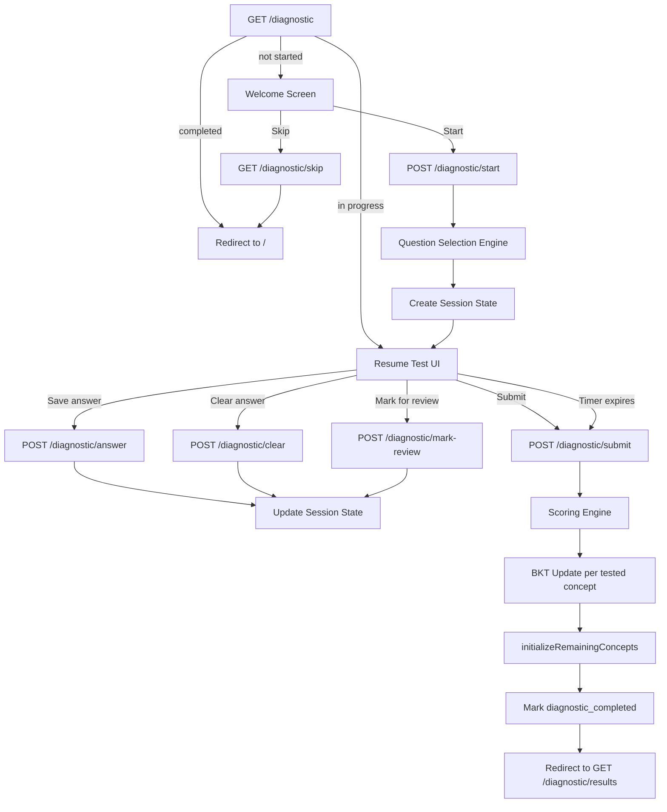

# Design Document: JEE Mains Format Diagnostic Test

## Overview

This design replaces the existing 45-question adaptive diagnostic (`routes/diagnostic.js` and `views/diagnostic.ejs`) with a full JEE Mains format exam: 90 MCQs, 3-hour timer, section tabs (Physics/Chemistry/Mathematics), question palette, +4/−1/0 marking, and post-submission BKT initialization.

The implementation stays within the existing Express/EJS/PostgreSQL stack. The route file is completely rewritten. The view is completely rewritten. The `initializeRemainingConcepts` function is preserved and reused for BKT inference after submission.

Key design decisions:
- **Server-authoritative state**: All answers are stored in `req.session`. The client sends individual answer saves via fetch (no full page reloads during the test). The server stores the start timestamp and validates time on submission.
- **Single-page test experience**: The `diagnostic.ejs` view handles the welcome screen, the test UI, and transitions between sections/questions entirely client-side using the data injected at render time. Answer saves and submission use `fetch()` to POST endpoints.
- **Question selection at start time**: All 90 questions are selected in a single SQL-driven operation when the student clicks "Start", stored in session, and served from session on every render/refresh.

## Architecture



## Components and Interfaces

### 1. Question Selection Engine (`selectDiagnosticQuestions`)

A server-side function that selects 90 questions from the `questions` table. Called once during `POST /diagnostic/start`.

**Algorithm:**

```
For each subject in [Physics, Chemistry, Mathematics]:
  1. Determine subject filter:
     - Physics: subject = 'Physics' (concepts table)
     - Chemistry: subject LIKE 'Chemistry%' (covers Chemistry - Physical, Chemistry - Inorganic, Chemistry - Organic)
     - Mathematics: subject = 'Mathematics'
  
  2. Target distribution per subject: 7 easy (tier 1), 13 medium (tier 2), 10 hard (tier 3)
  
  3. For each difficulty tier within the subject:
     a. Query approved questions, JOIN with concepts to filter by subject
     b. Use DISTINCT ON (q.concept_id) to get at most 1 question per subconcept
     c. ORDER BY RANDOM() to randomize selection
     d. LIMIT to the target count for that tier
  
  4. If a tier has fewer questions than needed, query the adjacent tier(s) for the deficit:
     - Tier 1 shortfall → fill from tier 2
     - Tier 3 shortfall → fill from tier 2
     - Tier 2 shortfall → fill from tier 1, then tier 3
     Exclude already-selected concept_ids to maintain max-1-per-subconcept where possible.
     If still short after adjacency fill, allow duplicate subconcepts.
  
  5. Assign sequence numbers: Physics 1–30, Chemistry 31–60, Mathematics 61–90
```

**SQL pattern for each tier selection:**

```sql
SELECT q.id, q.question_text, q.option1, q.option2, q.option3, q.option4,
       q.correct_answer, q.solution_text, q.concept_id, q.difficulty_tier
FROM questions q
JOIN concepts c ON q.concept_id = c.id
WHERE q.status = 'approved'
  AND q.difficulty_tier = $1
  AND c.subject LIKE $2          -- e.g., 'Physics' or 'Chemistry%' or 'Mathematics'
  AND q.concept_id NOT IN (...)  -- exclude already-selected concept_ids
ORDER BY q.concept_id, RANDOM()  -- group by concept, random within
LIMIT $3
```

Using a window function approach for the DISTINCT ON:

```sql
SELECT * FROM (
  SELECT q.*, ROW_NUMBER() OVER (PARTITION BY q.concept_id ORDER BY RANDOM()) as rn
  FROM questions q
  JOIN concepts c ON q.concept_id = c.id
  WHERE q.status = 'approved'
    AND q.difficulty_tier = $1
    AND c.subject LIKE $2
    AND q.concept_id NOT IN (SELECT UNNEST($3::text[]))
) sub WHERE rn = 1
ORDER BY RANDOM()
LIMIT $4
```

**Return value:** Array of 90 question objects, each containing `{ id, question_text, option1..option4, correct_answer, solution_text, concept_id, difficulty_tier, sequenceNumber, section }`.

### 2. Session State Structure

Stored in `req.session.diagnostic`:

```javascript
{
  started: true,
  startTimestamp: 1719000000000,       // Date.now() at test start — server-authoritative
  durationMs: 3 * 60 * 60 * 1000,     // 3 hours in ms (10,800,000)
  questions: [                          // Array of 90 question objects
    {
      seq: 1,                           // 1-indexed sequence number
      section: 'Physics',               // 'Physics' | 'Chemistry' | 'Mathematics'
      id: 42,                           // questions.id from DB
      question_text: '...',
      option1: '...', option2: '...', option3: '...', option4: '...',
      correct_answer: 'option2',
      concept_id: 'p_biot_savart',
      difficulty_tier: 2
    },
    // ... 89 more
  ],
  answers: {                            // keyed by sequence number (string)
    "1": "option3",                     // selected option or null
    "5": "option1",
    // unanswered questions have no key
  },
  markedForReview: {                    // keyed by sequence number (string)
    "3": true,
    "7": true
  }
}
```

Key points:
- `questions` array is immutable after creation — never modified during the test.
- `answers` is a plain object, not an array, for O(1) lookup by sequence number.
- `markedForReview` is a separate object so marking/unmarking is independent of answer state.
- `startTimestamp` is set once at start and never modified. The client computes remaining time as `durationMs - (Date.now() - startTimestamp)`.

### 3. Route Handlers

All routes are on the Express router exported from `routes/diagnostic.js`. All require `ensureAuthenticated`.

#### GET /diagnostic
- If `req.user.diagnostic_completed` → redirect to `/`
- If `req.session.diagnostic?.started` → check if time expired:
  - If `Date.now() - session.startTimestamp >= session.durationMs` → auto-submit (call scoring + BKT logic, redirect to results)
  - Else → render `diagnostic.ejs` with session state (resume)
- Else → render `diagnostic.ejs` with `started: false` (welcome screen)

#### POST /diagnostic/start
- If `req.user.diagnostic_completed` → redirect to `/`
- Call `selectDiagnosticQuestions()` to get 90 questions
- Create session state with `startTimestamp: Date.now()`
- Render `diagnostic.ejs` with the full test UI

#### POST /diagnostic/answer
- Body: `{ seq: number, answer: string }` (e.g., `{ seq: 5, answer: "option2" }`)
- Validate: seq is 1–90, answer is one of option1/option2/option3/option4
- Update `req.session.diagnostic.answers[seq] = answer`
- Respond with JSON `{ ok: true }`

#### POST /diagnostic/clear
- Body: `{ seq: number }`
- Delete `req.session.diagnostic.answers[seq]`
- Respond with JSON `{ ok: true }`

#### POST /diagnostic/mark-review
- Body: `{ seq: number, marked: boolean }`
- If `marked` → set `req.session.diagnostic.markedForReview[seq] = true`
- Else → delete `req.session.diagnostic.markedForReview[seq]`
- Respond with JSON `{ ok: true }`

#### POST /diagnostic/submit
- Validate time: if `Date.now() - startTimestamp < durationMs`, allow (early submit). Always allow (timer expiry is client-triggered but server validates).
- Run scoring engine (see Scoring section)
- Run BKT updates for each answered question's concept
- Call `initializeRemainingConcepts(userId, diagData)` for untested concepts
- Set `diagnostic_completed = true` in DB
- Log all answered questions to `user_question_attempts`
- Store result summary in `req.session.diagnosticResult`
- Delete `req.session.diagnostic`
- Respond with JSON `{ ok: true, redirect: '/diagnostic/results' }` (client does the redirect)

#### GET /diagnostic/results
- If `req.session.diagnosticResult` → render `diagnostic-results.ejs` with score data
- Else → redirect to `/`

#### GET /diagnostic/skip
- Set `diagnostic_completed = true` in DB
- Delete session diagnostic state if present
- Redirect to `/`

### 4. Timer Logic

**Server side:**
- `startTimestamp` is recorded as `Date.now()` in `POST /diagnostic/start`
- On every `GET /diagnostic` (resume), the server passes `startTimestamp` and `durationMs` to the template
- On `POST /diagnostic/submit`, the server does NOT reject late submissions — it processes whatever answers exist. The timer is a UX constraint, not a hard server gate.

**Client side:**
- On page load, compute `remainingMs = durationMs - (Date.now() - startTimestamp)`
- If `remainingMs <= 0`, immediately trigger auto-submit via fetch to `POST /diagnostic/submit`
- Otherwise, start a `setInterval(1000)` that:
  - Decrements the displayed time (HH:MM:SS format)
  - When `remainingMs < 15 * 60 * 1000` (15 min), add CSS class `timer-warning` (red color)
  - When `remainingMs <= 0`, auto-submit via fetch

### 5. Scoring Engine

Called during `POST /diagnostic/submit`:

```javascript
function computeScore(questions, answers) {
  let total = 0, correct = 0, incorrect = 0, unattempted = 0;
  const sections = { Physics: { score: 0, correct: 0, incorrect: 0, unattempted: 0 },
                     Chemistry: { score: 0, correct: 0, incorrect: 0, unattempted: 0 },
                     Mathematics: { score: 0, correct: 0, incorrect: 0, unattempted: 0 } };

  for (const q of questions) {
    const studentAnswer = answers[String(q.seq)];
    const sec = sections[q.section];

    if (!studentAnswer) {
      unattempted++;
      sec.unattempted++;
    } else if (studentAnswer === q.correct_answer) {
      total += 4;
      correct++;
      sec.score += 4;
      sec.correct++;
    } else {
      total -= 1;
      incorrect++;
      sec.score -= 1;
      sec.incorrect++;
    }
  }

  return { total, correct, incorrect, unattempted, maxScore: 360, sections };
}
```

### 6. BKT Initialization Flow

After scoring, the submit handler:

1. Groups answered questions by `concept_id`
2. For each concept with an answer:
   - Fetches current mastery via `getUserConceptMastery(userId, conceptId)`
   - Calls `bktUpdateConcept({ userId, skillId: conceptId, correct, p_mastery, difficulty_tier })`
   - Upserts the result into `user_concept_mastery`
3. Builds a `diagData` object compatible with `initializeRemainingConcepts`:
   ```javascript
   {
     answers: [{ conceptId, correct, difficultyTier }, ...],  // only answered questions
     sampledConcepts: questions.map(q => ({
       conceptId: q.concept_id,
       subject: mapSectionToSubjects(q.section)  // returns the DB subject values
     }))
   }
   ```
4. Calls `initializeRemainingConcepts(userId, diagData)` — this function is preserved as-is from the existing code. It handles upstream/downstream inference, chapter-level, and subject-level fallback.

**Subject mapping for BKT:**
The `section` field in session is one of `Physics`, `Chemistry`, `Mathematics`. The `initializeRemainingConcepts` function uses `concept.subject` from the `concepts` table, which has values like `'Physics'`, `'Chemistry - Physical'`, `'Chemistry - Inorganic'`, `'Chemistry - Organic'`, `'Mathematics'`. The function already handles this correctly because it queries `allConcepts` from the DB and uses the DB subject values directly.

### 7. View Architecture (`diagnostic.ejs`)

The EJS template renders two states:

**State 1: Welcome screen** (`!diagnostic.started`)
- Student name, test info (90 questions, 3 subjects, 3 hours)
- "Take Diagnostic Test" button → POST /diagnostic/start
- "Skip and Start Fresh" link → GET /diagnostic/skip

**State 2: Test UI** (`diagnostic.started`)

Layout (desktop):
```
┌─────────────────────────────────────────────────────────┐
│ Header: Learn.ai logo | Student name | Timer HH:MM:SS   │
├──────────────────────────────────┬──────────────────────┤
│ Section Tabs: [Phy] [Chem] [Math]│                      │
├──────────────────────────────────┤  Question Palette     │
│                                  │  (right panel)        │
│  Question Display Area           │  ┌──┬──┬──┬──┬──┐    │
│  - Question number & text        │  │1 │2 │3 │4 │5 │    │
│  - 4 radio options (A/B/C/D)     │  ├──┼──┼──┼──┼──┤    │
│  - MathJax rendered              │  │6 │7 │8 │...│  │    │
│                                  │  └──┴──┴──┴──┴──┘    │
│                                  │  Legend:              │
│                                  │  ⬜ Unattempted       │
│                                  │  🟩 Answered          │
│                                  │  🟪 Marked for Review │
│                                  │  🟪🟢 Answered+Marked │
├──────────────────────────────────┴──────────────────────┤
│ Footer: [Mark for Review & Next] [Clear] [Save & Next]   │
│         [Previous]                        [Submit Test]   │
└─────────────────────────────────────────────────────────┘
```

**Client-side state management:**
- All 90 questions are embedded in the page as a JSON object via `<script>const questions = <%- JSON.stringify(sanitizedQuestions) %>;</script>` (with `correct_answer` and `solution_text` stripped to prevent cheating)
- Current answers and review marks are also embedded as JSON from session state
- Section switching, question navigation, and palette clicks are pure JS — no server round-trips for navigation
- Answer save/clear/mark-review use `fetch()` to the respective POST endpoints
- Submit uses `fetch()` to POST /diagnostic/submit, then redirects on success

**Mobile layout:**
- Question palette becomes a collapsible drawer (toggle button in header)
- Section tabs stack horizontally with scroll
- Footer buttons wrap to 2 rows

**MathJax:** Loaded via CDN script tag. After each question render, call `MathJax.typesetPromise()` to re-render math content.

**Sanitized questions for client:**
The server strips `correct_answer` and `solution_text` from the questions array before embedding in the page. These fields stay only in `req.session.diagnostic.questions` on the server.

```javascript
const sanitizedQuestions = questions.map(q => ({
  seq: q.seq, section: q.section, id: q.id,
  question_text: q.question_text,
  option1: q.option1, option2: q.option2, option3: q.option3, option4: q.option4,
  difficulty_tier: q.difficulty_tier
}));
```

## Data Models

### Session State (req.session.diagnostic)

| Field | Type | Description |
|-------|------|-------------|
| started | boolean | Whether the test has been started |
| startTimestamp | number | `Date.now()` when test started |
| durationMs | number | Always 10800000 (3 hours) |
| questions | Array | 90 question objects with seq, section, id, text, options, correct_answer, concept_id, difficulty_tier |
| answers | Object | `{ [seq]: selectedOption }` — only answered questions have keys |
| markedForReview | Object | `{ [seq]: true }` — only marked questions have keys |

### Scoring Result (req.session.diagnosticResult)

| Field | Type | Description |
|-------|------|-------------|
| totalScore | number | Sum of +4/−1/0 across all 90 questions |
| maxScore | number | 360 |
| correct | number | Count of correct answers |
| incorrect | number | Count of incorrect answers |
| unattempted | number | Count of unanswered questions |
| sections | Object | `{ Physics: { score, correct, incorrect, unattempted }, Chemistry: {...}, Mathematics: {...} }` |

### Database Tables Used (no schema changes needed)

- `questions` — read-only, filtered by `status='approved'`, joined with `concepts` for subject
- `concepts` — read-only, used for subject filtering and BKT inference
- `concept_prerequisites` — read-only, used by `initializeRemainingConcepts`
- `user_concept_mastery` — upserted during BKT updates
- `user_question_attempts` — inserted for each answered question on submit
- `users` — `diagnostic_completed` flag updated on submit/skip


## Correctness Properties

*A property is a characteristic or behavior that should hold true across all valid executions of a system — essentially, a formal statement about what the system should do. Properties serve as the bridge between human-readable specifications and machine-verifiable correctness guarantees.*

### Property 1: Question selection produces correct count and section assignment

*For any* seeded question bank with at least 30 approved questions per subject, the Question Selection Engine shall return exactly 90 questions, with exactly 30 assigned to Physics (seq 1–30), 30 to Chemistry (seq 31–60), and 30 to Mathematics (seq 61–90), and all sequence numbers shall be unique integers from 1 to 90.

**Validates: Requirements 1.1, 1.4**

### Property 2: Question selection respects difficulty distribution

*For any* seeded question bank with sufficient approved questions, the Question Selection Engine shall select exactly 7 questions at difficulty_tier 1, 13 at difficulty_tier 2, and 10 at difficulty_tier 3 within each subject's 30-question allocation.

**Validates: Requirements 1.2**

### Property 3: Question selection maximizes subconcept coverage

*For any* seeded question bank, the Question Selection Engine shall select at most one question per subconcept (concept_id) before reusing any subconcept, and every selected question shall have a non-null concept_id.

**Validates: Requirements 1.3, 1.6**

### Property 4: Answer save round-trip

*For any* valid sequence number (1–90) and any valid option (option1/option2/option3/option4), saving an answer and then reading the session state shall return that exact answer for that sequence number. Saving a different answer for the same sequence number shall overwrite the previous answer.

**Validates: Requirements 2.2, 6.1, 6.5**

### Property 5: Clear response removes answer

*For any* question that has a saved answer in the session state, clearing the response for that question shall result in no answer being stored for that sequence number, while all other answers remain unchanged.

**Validates: Requirements 4.5, 6.3**

### Property 6: Mark for review toggle

*For any* question sequence number, marking it for review shall set its review flag to true, and unmarking shall remove the flag. The mark-for-review state shall be independent of the answer state — marking/unmarking shall not affect the saved answer.

**Validates: Requirements 6.4**

### Property 7: Question status derivation

*For any* question, given an answers object and a markedForReview object, the derived status shall be exactly one of: "unattempted" (no answer, not marked), "answered" (has answer, not marked), "marked-for-review" (no answer, marked), or "answered-and-marked" (has answer, marked). These four states are exhaustive and mutually exclusive.

**Validates: Requirements 4.2**

### Property 8: Timer remaining time computation

*For any* start timestamp and current timestamp where current >= start, the remaining time shall equal `durationMs - (current - start)`, clamped to a minimum of 0. The formatted output shall be a valid HH:MM:SS string where hours, minutes, and seconds are correctly derived from the remaining milliseconds.

**Validates: Requirements 5.1, 5.2**

### Property 9: Scoring follows +4/−1/0 marking scheme

*For any* set of 90 questions with known correct answers and any answer map (where each question is either answered correctly, answered incorrectly, or unattempted), the total score shall equal `4 * correctCount - 1 * incorrectCount + 0 * unattemptedCount`, and `correctCount + incorrectCount + unattemptedCount` shall equal 90.

**Validates: Requirements 7.1, 7.2, 7.3**

### Property 10: Section scores sum to total score

*For any* scoring result, the total score shall equal the sum of the Physics section score, Chemistry section score, and Mathematics section score. Similarly, the total correct/incorrect/unattempted counts shall equal the sum of the respective section counts.

**Validates: Requirements 7.4**

## Error Handling

| Scenario | Handling |
|----------|----------|
| Question bank has fewer than 30 approved questions for a subject | Fill from adjacent difficulty tiers. If still short, allow duplicate subconcepts. If a subject has zero questions, return an error and do not start the test. |
| Session expires mid-test (server restart, cookie expiry) | `GET /diagnostic` detects no session state → shows welcome screen. Student must restart. Session cookie `maxAge` is 24 hours, which exceeds the 3-hour test. |
| Student submits after timer expiry | Server processes the submission normally. The timer is a UX constraint; the server does not reject late submissions. |
| BKT service is unreachable during submission | Wrap BKT calls in try/catch. If BKT fails, still mark `diagnostic_completed = true` and store the score. Log the error. The student can still proceed; mastery will be at defaults. |
| Invalid answer value in POST /diagnostic/answer | Validate that `answer` is one of `option1`–`option4` and `seq` is 1–90. Return 400 JSON error if invalid. |
| Student tries to start test when already completed | All POST/GET handlers check `req.user.diagnostic_completed` first and redirect to `/`. |
| Database error during question selection | Return 500 with error message. Do not create partial session state. |
| Concurrent tab submissions | The first `POST /diagnostic/submit` processes and deletes the session. Subsequent submissions find no session and redirect to results or dashboard. |

## Testing Strategy

### Unit Tests

Unit tests cover specific examples and edge cases:

- Question Selection Engine with a known small question bank → verify exact output
- Scoring with all-correct, all-incorrect, all-unattempted, and mixed answer sets
- Timer formatting edge cases: exactly 3:00:00, exactly 0:00:00, 14:59 (just under warning threshold), 15:00 (at threshold)
- Question status derivation for all 4 states
- Fallback tier selection when a difficulty tier has zero questions
- Session state creation structure validation

### Property-Based Tests

Property-based tests use [fast-check](https://github.com/dubzzz/fast-check) (JavaScript PBT library). Each test runs a minimum of 100 iterations.

Each property test references its design document property:

- **Feature: diagnostic-jee-format, Property 1: Question selection produces correct count and section assignment** — Generate random question banks, run selection, verify 90 questions with correct section/seq distribution.
- **Feature: diagnostic-jee-format, Property 2: Question selection respects difficulty distribution** — Generate random question banks, verify 7/13/10 tier split per subject.
- **Feature: diagnostic-jee-format, Property 3: Question selection maximizes subconcept coverage** — Generate random question banks with many subconcepts, verify distinct concept_ids.
- **Feature: diagnostic-jee-format, Property 4: Answer save round-trip** — Generate random (seq, option) pairs, save to session state, read back, verify equality.
- **Feature: diagnostic-jee-format, Property 5: Clear response removes answer** — Generate random session states with answers, clear a random answer, verify removal without side effects.
- **Feature: diagnostic-jee-format, Property 6: Mark for review toggle** — Generate random mark/unmark sequences, verify independence from answer state.
- **Feature: diagnostic-jee-format, Property 7: Question status derivation** — Generate random combinations of answered/marked booleans, verify exactly one of four statuses.
- **Feature: diagnostic-jee-format, Property 8: Timer remaining time computation** — Generate random start timestamps and current timestamps, verify correct remaining time and HH:MM:SS formatting.
- **Feature: diagnostic-jee-format, Property 9: Scoring follows +4/−1/0 marking scheme** — Generate random answer maps for 90 questions, verify score = 4*correct - incorrect.
- **Feature: diagnostic-jee-format, Property 10: Section scores sum to total score** — Generate random answer maps, verify total = Physics + Chemistry + Mathematics for score and all counts.

Each property-based test must be tagged with a comment: `// Feature: diagnostic-jee-format, Property N: <title>`

Each correctness property is implemented by a single property-based test. Property tests handle comprehensive input coverage through randomization; unit tests focus on specific edge cases and integration points.
