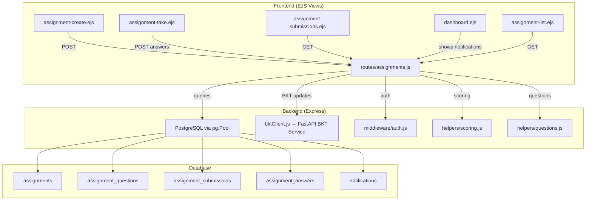

# Design Document: LMS Assignment System

## Overview

The LMS Assignment System adds teacher-created assignments to the existing coaching platform. Teachers select questions from the question bank, assign them to batches with deadlines, and review submission analytics. Students see pending assignments on their dashboard, take them in a test-like UI (modeled after the diagnostic test pattern), and receive JEE-pattern scoring (+4/−1/0). On submission, per-concept BKT mastery updates are triggered automatically.

The system integrates with existing infrastructure: Express routes, EJS views, PostgreSQL via `pg.Pool`, passport.js auth with role-based middleware, institute multi-tenancy, and the Python FastAPI BKT service.

### Key Design Decisions

1. **Reuse diagnostic UI pattern** — The `diagnostic.ejs` test-taking UI (question panel, palette, timer, navigation) is the closest existing pattern. The assignment-taking view will follow this structure but without a fixed timer (assignments are deadline-bound, not session-timed).
2. **Session-based state for in-progress assignments** — Like the diagnostic test, assignment progress (answers, start time) is stored in `req.session` during the attempt, then persisted to DB on submission.
3. **Separate route file** — `routes/assignments.js` follows the existing pattern of one route file per feature domain.
4. **Migration 011** — New tables added via `migrations/011_assignments.sql`, continuing the existing numbering.
5. **Scoring reuse** — The JEE scoring logic (+4/−1/0) is extracted into a shared helper since it's identical to the diagnostic scoring engine.

## Architecture



### Request Flow

1. **Assignment Creation**: Teacher → `POST /assignments/create` → validate inputs → insert into `assignments` + `assignment_questions` → create notifications for batch students → redirect to assignment list.
2. **Assignment Taking**: Student → `GET /assignments/:id/take` → check deadline & existing submission → load questions into session → render test UI. Student answers via `POST /assignments/:id/answer` (AJAX). Submit via `POST /assignments/:id/submit` → score → BKT updates → persist submission + answers → redirect to results.
3. **Submissions Dashboard**: Teacher → `GET /assignments/:id/submissions` → aggregate scores, concept breakdowns → render analytics view.

## Components and Interfaces

### Route: `routes/assignments.js`

| Endpoint | Method | Auth | Description |
|---|---|---|---|
| `/assignments` | GET | ensureInstituteUser | List teacher's assignments |
| `/assignments/create` | GET | ensureInstituteUser | Render creation form |
| `/assignments/create` | POST | ensureInstituteUser | Create assignment + notifications |
| `/assignments/:id/take` | GET | ensureAuthenticated | Render assignment-taking UI (student) |
| `/assignments/:id/answer` | POST | ensureAuthenticated | Save answer (AJAX, session-based) |
| `/assignments/:id/clear` | POST | ensureAuthenticated | Clear answer (AJAX) |
| `/assignments/:id/submit` | POST | ensureAuthenticated | Submit assignment, score, BKT update |
| `/assignments/:id/results` | GET | ensureAuthenticated | View own submission results (student) |
| `/assignments/:id/submissions` | GET | ensureInstituteUser | Teacher submissions dashboard |
| `/api/assignments/pending` | GET | ensureAuthenticated | Pending assignments for dashboard widget |

### Helper: `helpers/scoring.js`

Extracted from the diagnostic scoring engine to be shared:

```javascript
export function computeJeeScore(questions, answers) {
  // questions: [{ seq, correct_answer, ... }]
  // answers: { [seq]: selectedOption | undefined }
  // Returns: { total, correct, incorrect, unanswered, maxScore }
}
```

### Service Integration

- **bktClient.js** — `bktUpdateConcept()` called per-concept on submission (existing, no changes needed).
- **middleware/auth.js** — `ensureAuthenticated`, `ensureInstituteUser` used for route protection (existing, no changes needed).
- **helpers/mastery.js** — `getUserConceptMastery()` used to get current mastery before BKT update (existing).

### Views

| View | Purpose |
|---|---|
| `assignment-create.ejs` | Question bank browser with filters, question selection, batch/deadline form |
| `assignment-take.ejs` | Test-taking UI (modeled after diagnostic.ejs): question panel, option selection, navigation palette, submit |
| `assignment-list.ejs` | Teacher's assignment management list |
| `assignment-submissions.ejs` | Per-assignment submissions dashboard with scores, concept breakdowns |
| `dashboard.ejs` (modified) | Add pending assignments widget to existing student dashboard |

## Data Models

### New Tables (Migration 011)

#### `assignments`

| Column | Type | Constraints | Description |
|---|---|---|---|
| id | SERIAL | PRIMARY KEY | Assignment ID |
| institute_id | INTEGER | NOT NULL, FK → institutes(id) | Institute scope |
| batch_id | INTEGER | NOT NULL, FK → batches(id) | Target batch |
| created_by | INTEGER | NOT NULL, FK → users(id) | Teacher who created |
| title | VARCHAR(255) | NOT NULL | Assignment title |
| deadline | TIMESTAMPTZ | NOT NULL | Submission deadline |
| created_at | TIMESTAMPTZ | DEFAULT now() | Creation timestamp |

#### `assignment_questions`

| Column | Type | Constraints | Description |
|---|---|---|---|
| assignment_id | INTEGER | FK → assignments(id) ON DELETE CASCADE | Parent assignment |
| question_id | INTEGER | FK → questions(id) | Selected question |
| question_order | INTEGER | NOT NULL | Display order (1-based) |
| PRIMARY KEY | | (assignment_id, question_id) | Composite key |

#### `assignment_submissions`

| Column | Type | Constraints | Description |
|---|---|---|---|
| id | SERIAL | PRIMARY KEY | Submission ID |
| assignment_id | INTEGER | NOT NULL, FK → assignments(id) | Parent assignment |
| user_id | INTEGER | NOT NULL, FK → users(id) | Student who submitted |
| score | INTEGER | NOT NULL | Computed total score |
| max_score | INTEGER | NOT NULL | questions × 4 |
| time_taken_seconds | INTEGER | | Elapsed time from start to submit |
| started_at | TIMESTAMPTZ | | When student opened the assignment |
| submitted_at | TIMESTAMPTZ | DEFAULT now() | Submission timestamp |
| UNIQUE | | (assignment_id, user_id) | One submission per student per assignment |

#### `assignment_answers`

| Column | Type | Constraints | Description |
|---|---|---|---|
| id | SERIAL | PRIMARY KEY | Answer ID |
| submission_id | INTEGER | NOT NULL, FK → assignment_submissions(id) ON DELETE CASCADE | Parent submission |
| question_id | INTEGER | NOT NULL, FK → questions(id) | Answered question |
| selected_option | VARCHAR(10) | NULLABLE | 'option1'–'option4' or NULL if unanswered |
| is_correct | BOOLEAN | NOT NULL | Whether the answer was correct |

#### `notifications`

| Column | Type | Constraints | Description |
|---|---|---|---|
| id | SERIAL | PRIMARY KEY | Notification ID |
| user_id | INTEGER | NOT NULL, FK → users(id) | Recipient |
| type | VARCHAR(50) | NOT NULL | e.g. 'assignment' |
| reference_id | INTEGER | | FK to the relevant entity (assignment id) |
| title | VARCHAR(255) | NOT NULL | Notification title |
| message | TEXT | | Notification body |
| is_read | BOOLEAN | DEFAULT false | Read status |
| created_at | TIMESTAMPTZ | DEFAULT now() | Creation timestamp |

### Indexes

```sql
CREATE INDEX idx_assignment_submissions_assignment ON assignment_submissions(assignment_id);
CREATE INDEX idx_assignment_submissions_user ON assignment_submissions(user_id);
CREATE INDEX idx_assignment_answers_submission ON assignment_answers(submission_id);
CREATE INDEX idx_notifications_user_read ON notifications(user_id, is_read);
CREATE INDEX idx_assignments_batch ON assignments(batch_id);
CREATE INDEX idx_assignments_created_by ON assignments(created_by);
```


## Correctness Properties

*A property is a characteristic or behavior that should hold true across all valid executions of a system — essentially, a formal statement about what the system should do. Properties serve as the bridge between human-readable specifications and machine-verifiable correctness guarantees.*

### Property 1: JEE Scoring Correctness

*For any* set of questions and student answers (where each answer is one of option1–option4 or unanswered), the computed score SHALL equal `4 × correct_count − 1 × wrong_count`, and the max_score SHALL equal `question_count × 4`.

**Validates: Requirements 4.1, 4.4**

### Property 2: Assignment Status Computation

*For any* assignment and student, the computed status SHALL be:
- "Pending" if the deadline is in the future AND no submission exists
- "Completed" if a submission exists
- "Missed" if the deadline has passed AND no submission exists

**Validates: Requirements 2.3, 2.4, 2.5, 7.3**

### Property 3: Question Filter Scoping

*For any* subject, concept_id, and difficulty_tier filter combination applied by a teacher, all returned questions SHALL have `status = 'approved'` AND (`institute_id = teacher's institute_id` OR `institute_id IS NULL`), and SHALL match the applied filter values.

**Validates: Requirements 1.2**

### Property 4: Deadline Validation

*For any* timestamp in the past, attempting to create an assignment with that deadline SHALL be rejected. *For any* timestamp in the future, the deadline SHALL be accepted (assuming other inputs are valid).

**Validates: Requirements 1.4**

### Property 5: Batch Authorization

*For any* batch that does not belong to the teacher's institute, assignment creation SHALL be rejected with 403. *For any* student not in the assignment's target batch, accessing the assignment SHALL be denied.

**Validates: Requirements 1.6, 9.2**

### Property 6: Assignment Creation Produces Notifications

*For any* batch with N students, creating an assignment for that batch SHALL produce exactly N notification records, one per student, each with the correct assignment reference_id.

**Validates: Requirements 2.1, 1.3**

### Property 7: Submission Idempotency

*For any* assignment that a student has already submitted, a subsequent submission attempt SHALL be rejected, and the original submission record SHALL remain unchanged.

**Validates: Requirements 3.6**

### Property 8: Question Order Immutability

*For any* assignment, the questions and their ordering (as stored in `assignment_questions.question_order`) SHALL remain constant across all accesses within the same assignment session and across sessions.

**Validates: Requirements 3.7**

### Property 9: Submission Record Completeness

*For any* assignment with Q questions, upon submission the system SHALL create exactly Q `assignment_answers` records (one per question, with `selected_option` NULL for unanswered) and one `user_question_attempt` record per answered question.

**Validates: Requirements 4.2, 5.3**

### Property 10: BKT Updates Grouped by Concept

*For any* assignment submission, the system SHALL invoke exactly one BKT mastery update per distinct concept_id present in the assignment questions, with the correct correctness data for that concept's answers.

**Validates: Requirements 5.2**

### Property 11: Concept-Wise Breakdown Correctness

*For any* submission, the concept-wise breakdown SHALL satisfy: for each concept, `correct_count + incorrect_count + unanswered_count = total_questions_for_concept`, and the percentage SHALL equal `correct_count / total_questions_for_concept × 100`.

**Validates: Requirements 6.3**

### Property 12: Batch Aggregate Statistics

*For any* set of submissions for an assignment, the average score SHALL equal `sum(scores) / count(submissions)`, the highest score SHALL equal `max(scores)`, the lowest score SHALL equal `min(scores)`, and the average time SHALL equal `sum(time_taken) / count(submissions)`.

**Validates: Requirements 6.4**

### Property 13: Institute Auto-Association

*For any* assignment created by a teacher, the assignment's `institute_id` SHALL equal the teacher's `institute_id`. Assignment creation SHALL be restricted to users with role `teacher` or `institute_admin` who have a non-null `institute_id`.

**Validates: Requirements 9.1, 9.4**

### Property 14: Submissions Dashboard Authorization

*For any* user who is neither the assignment creator nor an `institute_admin` of the same institute, accessing the submissions dashboard SHALL be denied.

**Validates: Requirements 9.3**

### Property 15: Deadline Blocks Assignment Access

*For any* assignment whose deadline has passed, a student attempting to open/take the assignment SHALL be rejected with a "Deadline passed" message.

**Validates: Requirements 3.5**

## Error Handling

| Scenario | Handling |
|---|---|
| BKT service unavailable on submission | Save submission and answers to DB. Log warning. Return success to student with a note that mastery update is deferred. Follow existing pattern from `routes/diagnostic.js` where BKT errors are caught per-concept. |
| Question bank returns no results for filters | Display empty state in creation UI. No error thrown. |
| Student opens assignment after deadline | Redirect to dashboard with flash message "Deadline passed." |
| Student attempts re-submission | Redirect to results page showing existing submission. |
| Teacher accesses batch outside their institute | Return 403 Forbidden. |
| Database constraint violation (duplicate submission) | Catch unique constraint error on `(assignment_id, user_id)`, redirect to existing results. |
| Session lost mid-assignment | Student can re-open the assignment (if before deadline and no submission). Session is re-initialized from DB (questions loaded from `assignment_questions`). Answers already saved via AJAX are preserved in session. |
| Invalid question IDs in creation request | Validate all question IDs exist and are approved before creating assignment. Return 400 with error message. |

## Testing Strategy

### Unit Tests

Unit tests cover specific examples, edge cases, and integration points:

- **Scoring edge cases**: All correct (max score), all wrong (negative score), all unanswered (zero), mixed answers
- **Status computation**: Exact boundary — deadline is exactly now, submission exists vs not
- **Empty assignment validation**: Zero questions selected → rejected
- **Deadline validation**: Past date, current date, future date
- **Authorization**: Teacher with no institute_id, student accessing wrong batch, admin override
- **BKT failure handling**: Mock BKT service returning errors, verify submission still saved
- **Notification creation**: Batch with 0 students, batch with 1 student, batch with many students

### Property-Based Tests

Property-based tests use [fast-check](https://github.com/dubzzz/fast-check) (the standard PBT library for JavaScript/Node.js). Each test runs a minimum of 100 iterations.

Each property test references its design document property with a tag comment:

```javascript
// Feature: lms-assignment-system, Property 1: JEE Scoring Correctness
```

Property tests to implement:

1. **JEE Scoring** — Generate random arrays of questions with random answers. Verify score = 4×correct − 1×wrong, max = questions×4.
2. **Assignment Status** — Generate random (deadline, hasSubmission, now) tuples. Verify status computation.
3. **Question Filter Scoping** — Generate random filter combinations and question sets. Verify all returned questions match filters and institute scope.
4. **Deadline Validation** — Generate random timestamps relative to now. Verify past dates rejected, future dates accepted.
5. **Batch Authorization** — Generate random (teacher_institute, batch_institute) pairs. Verify rejection when mismatched.
6. **Notification Count** — Generate random batch sizes. Verify notification count equals student count.
7. **Submission Idempotency** — Generate random submissions, attempt double-submit, verify rejection.
8. **Question Order Immutability** — Generate random question sets, verify order preserved across reads.
9. **Submission Record Completeness** — Generate random answer sets, verify record counts match.
10. **BKT Grouping** — Generate random questions across multiple concepts, verify one BKT call per concept.
11. **Concept Breakdown** — Generate random per-concept answer distributions, verify correct+incorrect+unanswered = total per concept.
12. **Batch Aggregates** — Generate random score arrays, verify avg/max/min/avg_time computations.
13. **Institute Association** — Generate random teacher/institute pairs, verify assignment inherits institute_id.
14. **Submissions Auth** — Generate random (user_role, user_institute, creator_id, assignment_institute) tuples, verify access control.
15. **Deadline Blocks Access** — Generate random (deadline, now) pairs where deadline < now, verify access denied.

### Test Configuration

- Library: `fast-check` (npm package)
- Minimum iterations: 100 per property
- Tag format: `Feature: lms-assignment-system, Property {N}: {title}`
- Each correctness property maps to exactly one property-based test
