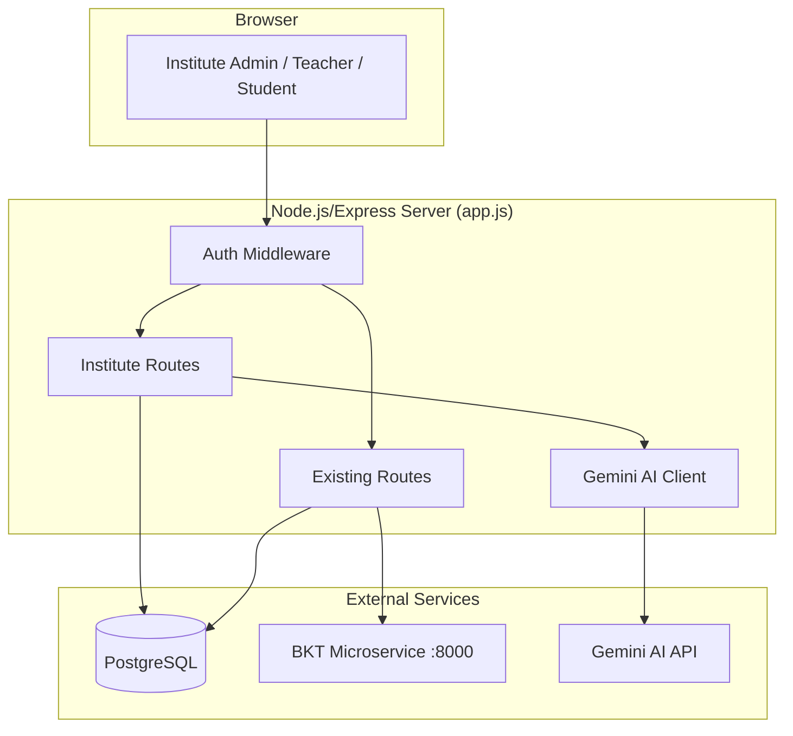
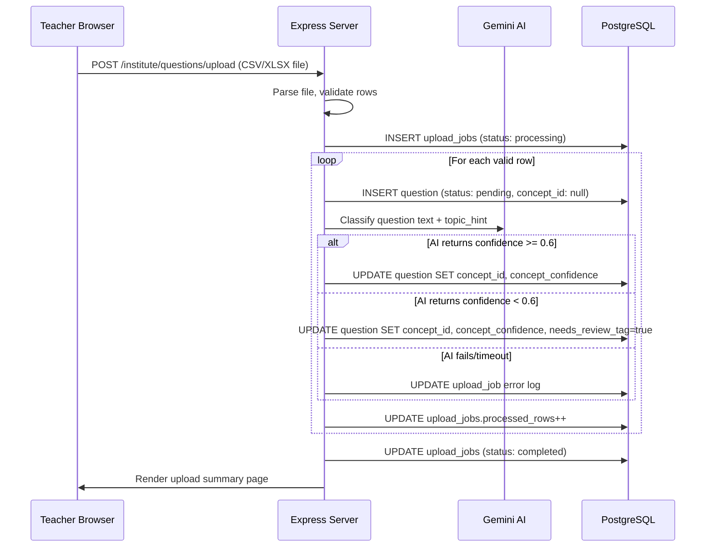
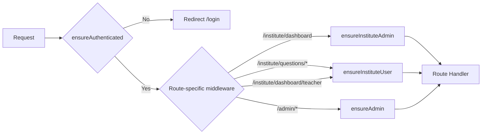
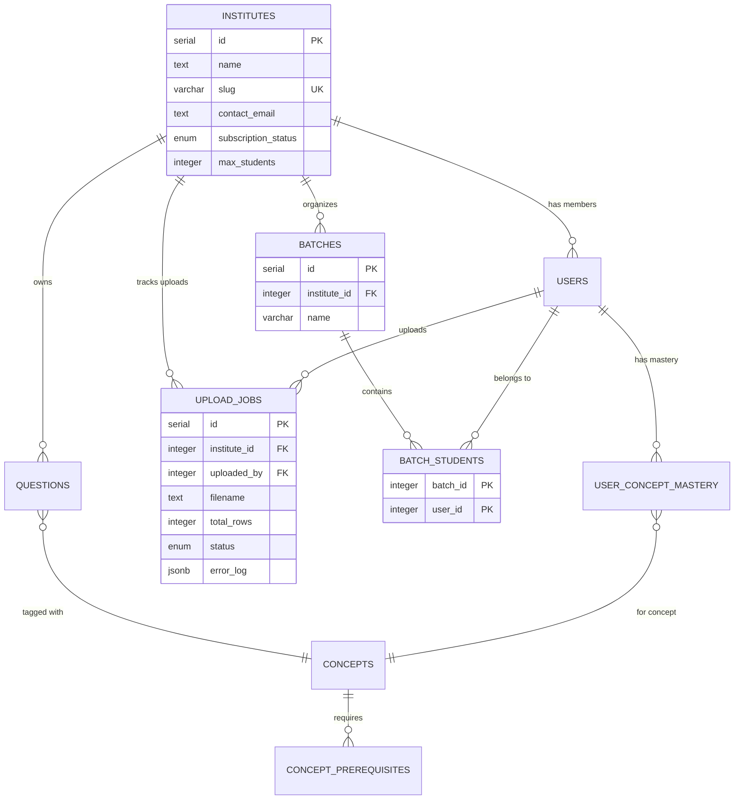

# Design Document — MVP Coaching Center Platform

## Overview

This design extends the existing Learn.ai Node.js/Express monolith to support multi-tenant coaching center operations. The three pillars — multi-tenancy, question ingestion pipeline, and teacher dashboard — are implemented as new routes and middleware within the existing `app.js`, new PostgreSQL tables alongside the current schema, and new EJS views following the existing rendering pattern.

The design preserves backward compatibility: existing platform-level users (role `student` or `admin` with `institute_id IS NULL`) continue to work unchanged. Institute-scoped users see only their institute's data plus shared platform questions.

### Key Design Decisions

1. **Monolith extension, not microservices** — All new routes live in `app.js` (or a new `routes/institute.js` file extracted for organization). No new services beyond the existing BKT microservice.
2. **Nullable `institute_id` for backward compatibility** — Existing users and questions keep `institute_id = NULL`. Institute-scoped queries use `WHERE institute_id = $1 OR institute_id IS NULL`.
3. **Synchronous AI tagging during upload** — Each row is tagged via Gemini sequentially during the upload POST handler. For MVP, this keeps the architecture simple (no job queue). A 10-second timeout per AI call prevents blocking.
4. **EJS server-rendered dashboard** — The heatmap and stuck-students panels are rendered server-side with data passed to EJS. Client-side JavaScript handles color-coding and interactivity.
5. **Reuse existing auth** — Passport-local session auth is extended with role-based middleware (`ensureInstituteAdmin`, `ensureInstituteUser`) rather than introducing a new auth system.

## Architecture

### System Context



### Request Flow for Question Upload



### Middleware Chain



## Components and Interfaces

### New Middleware Functions

```javascript
// Allows institute_admin only
function ensureInstituteAdmin(req, res, next) {
    if (req.isAuthenticated() && req.user.role === 'institute_admin' && req.user.institute_id) {
        return next();
    }
    res.status(403).send('Forbidden');
}

// Allows teacher and institute_admin within an institute
function ensureInstituteUser(req, res, next) {
    if (req.isAuthenticated() && 
        ['teacher', 'institute_admin'].includes(req.user.role) && 
        req.user.institute_id) {
        return next();
    }
    res.status(403).send('Forbidden');
}
```

### New Route Groups

| Route | Method | Middleware | Description |
|-------|--------|-----------|-------------|
| `/institute/register` | GET/POST | none (public) | Institute registration form and handler |
| `/institute/dashboard` | GET | `ensureInstituteAdmin` | Admin dashboard with institute stats |
| `/institute/invite` | GET/POST | `ensureInstituteAdmin` | Invite teachers/students |
| `/institute/batches` | GET/POST | `ensureInstituteAdmin` | Create batches, assign students |
| `/institute/questions/upload` | GET/POST | `ensureInstituteUser` | Bulk question upload |
| `/institute/questions/review` | GET | `ensureInstituteUser` | Review queue page |
| `/institute/questions/review/:id` | POST | `ensureInstituteUser` | Approve/reject/edit question |
| `/institute/dashboard/teacher` | GET | `ensureInstituteUser` | Teacher dashboard (heatmap, stuck students) |
| `/institute/dashboard/teacher/gaps/:userId/:conceptId` | GET | `ensureInstituteUser` | Prerequisite gap analysis for a student |
| `/api/institute/questions/stats` | GET | `ensureInstituteUser` | Question bank statistics JSON |

### AI Concept Tagging Function

```javascript
async function classifyQuestionConcept(questionText, topicHint, conceptList) {
    const conceptListStr = conceptList.map(c => `${c.id}: ${c.name}`).join('\n');
    const systemPrompt = `You are a JEE Physics/Mathematics question classifier. 
Given a question, classify it into exactly one concept from the list below.
Return ONLY a JSON object: {"concept_id": "...", "confidence": 0.0-1.0}

Concepts:
${conceptListStr}`;

    const userPrompt = topicHint 
        ? `Question: ${questionText}\nTopic hint: ${topicHint}`
        : `Question: ${questionText}`;

    const response = await geminiGenerate(systemPrompt, userPrompt);
    return JSON.parse(response.replace(/```json\n?|\n?```/g, '').trim());
}
```

### CSV/XLSX Parsing

The upload handler uses `multer` (already installed) for file reception and `xlsx` (new dependency) for parsing both CSV and XLSX formats:

```javascript
import XLSX from 'xlsx';

function parseUploadedFile(buffer, filename) {
    const workbook = XLSX.read(buffer, { type: 'buffer' });
    const sheet = workbook.Sheets[workbook.SheetNames[0]];
    const rows = XLSX.utils.sheet_to_json(sheet, { defval: '' });
    return rows; // Array of objects with column headers as keys
}
```

### Dashboard Data Aggregation Queries

**Batch Mastery Heatmap:**
```sql
SELECT u.id as user_id, u.name as student_name,
       c.id as concept_id, c.name as concept_name, c.subject,
       COALESCE(ucm.mastery, 0.2) as mastery
FROM batch_students bs
JOIN users u ON u.id = bs.user_id
CROSS JOIN concepts c
LEFT JOIN user_concept_mastery ucm ON ucm.user_id = u.id AND ucm.concept_id = c.id
WHERE bs.batch_id = $1
ORDER BY u.name, c.subject, c.name
```

**Stuck Students Detection:**
```sql
SELECT u.id as user_id, u.name, c.id as concept_id, c.name as concept_name,
       ucm.mastery, ucm.questions_answered, ucm.correct_answers
FROM user_concept_mastery ucm
JOIN users u ON u.id = ucm.user_id
JOIN concepts c ON c.id = ucm.concept_id
WHERE u.institute_id = $1
  AND ucm.mastery < 0.5
  AND ucm.questions_answered > 10
ORDER BY ucm.mastery ASC
```

**Institute Question Stats:**
```sql
-- Total and by status
SELECT status, COUNT(*) as count FROM questions WHERE institute_id = $1 GROUP BY status;
-- By concept
SELECT concept_id, c.name, COUNT(*) as count FROM questions q
JOIN concepts c ON c.id = q.concept_id WHERE q.institute_id = $1 AND q.status = 'approved'
GROUP BY concept_id, c.name ORDER BY count DESC;
-- By difficulty
SELECT difficulty_tier, COUNT(*) as count FROM questions WHERE institute_id = $1 GROUP BY difficulty_tier;
-- Last 7 days
SELECT COUNT(*) as count FROM questions WHERE institute_id = $1 AND created_at > NOW() - INTERVAL '7 days';
```

## Data Models

### New Tables

#### `institutes`
| Column | Type | Constraints | Notes |
|--------|------|-------------|-------|
| id | SERIAL | PRIMARY KEY | |
| name | TEXT | NOT NULL | Institute display name |
| slug | VARCHAR(100) | UNIQUE, NOT NULL | URL-safe identifier |
| contact_email | TEXT | | Primary contact |
| subscription_status | subscription_status (enum) | DEFAULT 'trial' | trial, active, suspended, cancelled |
| max_students | INTEGER | DEFAULT 500 | Seat limit |
| created_at | TIMESTAMPTZ | DEFAULT now() | |
| updated_at | TIMESTAMPTZ | DEFAULT now() | |

#### `batches`
| Column | Type | Constraints | Notes |
|--------|------|-------------|-------|
| id | SERIAL | PRIMARY KEY | |
| institute_id | INTEGER | NOT NULL, FK → institutes.id | |
| name | VARCHAR(255) | NOT NULL | e.g. "JEE 2026 Batch A" |
| created_at | TIMESTAMPTZ | DEFAULT now() | |

#### `batch_students`
| Column | Type | Constraints | Notes |
|--------|------|-------------|-------|
| batch_id | INTEGER | FK → batches.id | Composite PK |
| user_id | INTEGER | FK → users.id | Composite PK |

#### `upload_jobs`
| Column | Type | Constraints | Notes |
|--------|------|-------------|-------|
| id | SERIAL | PRIMARY KEY | |
| institute_id | INTEGER | FK → institutes.id | |
| uploaded_by | INTEGER | FK → users.id | |
| filename | TEXT | | Original filename |
| total_rows | INTEGER | | |
| processed_rows | INTEGER | DEFAULT 0 | |
| failed_rows | INTEGER | DEFAULT 0 | |
| status | upload_job_status (enum) | | processing, completed, failed |
| error_log | JSONB | DEFAULT '[]' | Array of {row, error} objects |
| created_at | TIMESTAMPTZ | DEFAULT now() | |
| completed_at | TIMESTAMPTZ | | |

### Modified Tables

#### `users` — add columns
| Column | Type | Constraints | Notes |
|--------|------|-------------|-------|
| institute_id | INTEGER | NULLABLE, FK → institutes.id | NULL for platform-level users |

The `role` column already exists as VARCHAR(20). The new values `teacher` and `institute_admin` fit within the existing column. No enum change needed since it's a VARCHAR.

#### `questions` — add columns
| Column | Type | Constraints | Notes |
|--------|------|-------------|-------|
| institute_id | INTEGER | NULLABLE, FK → institutes.id | NULL for shared platform questions |
| concept_confidence | NUMERIC(3,2) | | AI classification confidence 0.0–1.0 |
| needs_review_tag | BOOLEAN | DEFAULT false | Flagged when AI confidence < 0.6 |

Note: `concept_id` on `questions` must be changed from `NOT NULL` to `NULLABLE` to support the ingestion pipeline where questions are inserted before AI tagging completes.

### Schema Migration SQL

```sql
-- New enum types
CREATE TYPE subscription_status AS ENUM ('trial', 'active', 'suspended', 'cancelled');
CREATE TYPE upload_job_status AS ENUM ('processing', 'completed', 'failed');

-- New tables
CREATE TABLE institutes (
    id SERIAL PRIMARY KEY,
    name TEXT NOT NULL,
    slug VARCHAR(100) UNIQUE NOT NULL,
    contact_email TEXT,
    subscription_status subscription_status DEFAULT 'trial',
    max_students INTEGER DEFAULT 500,
    created_at TIMESTAMPTZ DEFAULT now(),
    updated_at TIMESTAMPTZ DEFAULT now()
);

CREATE TABLE batches (
    id SERIAL PRIMARY KEY,
    institute_id INTEGER NOT NULL REFERENCES institutes(id),
    name VARCHAR(255) NOT NULL,
    created_at TIMESTAMPTZ DEFAULT now()
);

CREATE TABLE batch_students (
    batch_id INTEGER REFERENCES batches(id) ON DELETE CASCADE,
    user_id INTEGER REFERENCES users(id) ON DELETE CASCADE,
    PRIMARY KEY (batch_id, user_id)
);

CREATE TABLE upload_jobs (
    id SERIAL PRIMARY KEY,
    institute_id INTEGER REFERENCES institutes(id),
    uploaded_by INTEGER REFERENCES users(id),
    filename TEXT,
    total_rows INTEGER,
    processed_rows INTEGER DEFAULT 0,
    failed_rows INTEGER DEFAULT 0,
    status upload_job_status DEFAULT 'processing',
    error_log JSONB DEFAULT '[]',
    created_at TIMESTAMPTZ DEFAULT now(),
    completed_at TIMESTAMPTZ
);

-- Alter existing tables
ALTER TABLE users ADD COLUMN institute_id INTEGER REFERENCES institutes(id);
ALTER TABLE questions ADD COLUMN institute_id INTEGER REFERENCES institutes(id);
ALTER TABLE questions ADD COLUMN concept_confidence NUMERIC(3,2);
ALTER TABLE questions ADD COLUMN needs_review_tag BOOLEAN DEFAULT false;
ALTER TABLE questions ALTER COLUMN concept_id DROP NOT NULL;

-- Indexes for query performance
CREATE INDEX idx_users_institute ON users(institute_id);
CREATE INDEX idx_questions_institute ON questions(institute_id);
CREATE INDEX idx_questions_status_institute ON questions(status, institute_id);
CREATE INDEX idx_batch_students_user ON batch_students(user_id);
CREATE INDEX idx_upload_jobs_institute ON upload_jobs(institute_id);
CREATE INDEX idx_user_concept_mastery_mastery ON user_concept_mastery(mastery);
```

### Entity Relationship Diagram




## Correctness Properties

*A property is a characteristic or behavior that should hold true across all valid executions of a system — essentially, a formal statement about what the system should do. Properties serve as the bridge between human-readable specifications and machine-verifiable correctness guarantees.*

### Property 1: Institute ID Propagation

*For any* user (teacher or student) created within an institute, and *for any* question uploaded by an institute user, the resulting record's `institute_id` must equal the creating/uploading user's `institute_id`.

**Validates: Requirements 1.7, 1.8, 3.2, 3.3, 4.5**

### Property 2: Data Isolation Scoping

*For any* institute-scoped query (questions, mastery, stats) executed by a user with a non-null `institute_id`, every returned record must have `institute_id` equal to the user's `institute_id` OR `institute_id IS NULL` (shared platform content).

**Validates: Requirements 3.6, 10.1, 10.3, 11.3**

### Property 3: Registration Creates Trial Institute and Admin

*For any* valid registration payload (unique slug, unique email, non-empty name and password), the system must create exactly one institute with `subscription_status = 'trial'` and exactly one user with `role = 'institute_admin'` whose `institute_id` references the new institute.

**Validates: Requirements 2.2**

### Property 4: Duplicate Registration Rejection

*For any* registration attempt where the slug matches an existing institute's slug OR the email matches an existing user's email, the system must reject the request and the total count of institutes and users must remain unchanged.

**Validates: Requirements 2.3**

### Property 5: Cross-Institute Invitation Rejection

*For any* invitation where the target email belongs to a user whose `institute_id` is non-null and differs from the inviting admin's `institute_id`, the system must reject the invitation and no new user record must be created.

**Validates: Requirements 3.4**

### Property 6: Batch Student Assignment Integrity

*For any* batch within an institute and *for any* set of student user IDs assigned to that batch, the `batch_students` table must contain exactly one row per (batch_id, user_id) pair, and every assigned user must have `institute_id` matching the batch's institute.

**Validates: Requirements 3.5**

### Property 7: Upload File Validation

*For any* uploaded file, if the file size exceeds 10 MB or the file extension is not `.csv` or `.xlsx`, the system must reject the upload and no question records or upload_job records must be created.

**Validates: Requirements 4.2**

### Property 8: Row Validation Error Reporting

*For any* row in an uploaded file that is missing any of the required fields (`question_text`, `option1`–`option4`, `correct_answer`), the system must report an error for that specific row number and must not insert a question record for that row.

**Validates: Requirements 4.4**

### Property 9: Upload Summary Count Accuracy

*For any* completed upload job, `total_rows` must equal `processed_rows + failed_rows`, and `processed_rows` must equal the count of questions in the database with the corresponding upload job's institute_id created during that upload.

**Validates: Requirements 4.7**

### Property 10: AI Classification Result Handling

*For any* AI classification response for a question, the question's `concept_id` must be set to the returned concept, `concept_confidence` must be set to the returned confidence value, and `needs_review_tag` must be `true` if and only if `concept_confidence < 0.6`.

**Validates: Requirements 5.3, 5.4**

### Property 11: AI Failure Graceful Handling

*For any* AI call that fails or exceeds the 10-second timeout, the question's `concept_id` must remain `NULL`, the question's `status` must remain `pending`, and the upload job's `error_log` must contain an entry for that question.

**Validates: Requirements 5.5**

### Property 12: Review Action State Transition

*For any* review action (approve, reject, or edit-then-approve) on a pending question, the question's `status` must be set to the corresponding value (`approved` or `rejected`), `verified_by` must equal the reviewer's user ID, `verified_at` must be set to a timestamp no earlier than the action time, and any edited fields (concept_id, difficulty_tier, question_text) must reflect the submitted edits.

**Validates: Requirements 6.4, 6.5, 6.6**

### Property 13: Review Queue Statistics Accuracy

*For any* institute, the review queue statistics must satisfy: `pending_count + approved_count + rejected_count = total_questions` where all counts are scoped to that institute's questions.

**Validates: Requirements 6.7**

### Property 14: Heatmap Data Completeness

*For any* batch with N students and M concepts (optionally filtered by subject), the heatmap data must contain exactly N × M entries, one per student-concept pair, with mastery defaulting to 0.2 where no `user_concept_mastery` record exists.

**Validates: Requirements 7.2**

### Property 15: Heatmap Color Coding

*For any* mastery value, the assigned color must be: red if mastery < 0.4, yellow if 0.4 ≤ mastery < 0.7, green if mastery ≥ 0.7.

**Validates: Requirements 7.3**

### Property 16: Heatmap Subject Filtering

*For any* subject filter applied to the heatmap, every concept in the result must have `subject` equal to the filter value, and no concept with a matching subject must be excluded.

**Validates: Requirements 7.4**

### Property 17: Batch Average Mastery Correctness

*For any* batch and *for any* concept, the batch-average mastery displayed must equal the arithmetic mean of all students' mastery values for that concept within the batch (using 0.2 as default for missing records).

**Validates: Requirements 7.5**

### Property 18: Stuck Student Detection

*For any* set of `user_concept_mastery` records within an institute, the stuck students list must contain exactly those records where `mastery < 0.5 AND questions_answered > 10`, and must include only students whose `institute_id` matches the requesting teacher's institute.

**Validates: Requirements 8.1, 8.5**

### Property 19: Stuck Students Ordering

*For any* list of stuck students returned by the system, the list must be sorted by mastery in ascending order (lowest mastery first).

**Validates: Requirements 8.2**

### Property 20: Prerequisite Gaps Depth Ordering

*For any* student and target concept, the prerequisite gaps returned must be ordered by depth descending (deepest prerequisite first), and every returned concept must have mastery below 0.7.

**Validates: Requirements 9.1, 9.2**

### Property 21: Learning Path Structure

*For any* student and target concept, the learning path must end with the target concept, and every concept in the path (except the target) must be a prerequisite gap with mastery below 0.7.

**Validates: Requirements 9.3**

### Property 22: Institute Access Control

*For any* user attempting to access institute-scoped resources (dashboard, review queue, stats), access must be granted if and only if the user's `institute_id` matches the target institute OR the user's role is `admin`. All other attempts must receive a 403 response.

**Validates: Requirements 10.4, 10.5**

## Error Handling

### Upload Errors

| Error Scenario | Handling | User Feedback |
|---------------|----------|---------------|
| File too large (>10MB) | Reject at multer level | "File exceeds 10MB limit" flash message |
| Invalid file type | Check extension before parsing | "Only CSV and XLSX files are accepted" |
| Malformed CSV/XLSX | Catch XLSX parse error | "Could not parse file. Ensure it is a valid CSV or Excel file" |
| Missing required columns | Validate header row | "Missing required columns: [list]" |
| Row missing required fields | Skip row, log error | Per-row error in upload summary |
| Duplicate question text | Allow (no unique constraint on question_text) | N/A |

### AI Tagging Errors

| Error Scenario | Handling | Recovery |
|---------------|----------|----------|
| Gemini API timeout (>10s) | Catch timeout, log to upload_job.error_log | Question stays pending with concept_id=NULL, reviewable manually |
| Gemini API error (4xx/5xx) | Catch error, log details | Same as timeout |
| Invalid JSON response | Catch parse error, log raw response | Same as timeout |
| Concept ID not in valid list | Reject classification, log | Question flagged needs_review_tag=true |
| Rate limiting | Exponential backoff not implemented in MVP | Log error, continue to next question |

### Access Control Errors

| Error Scenario | Response |
|---------------|----------|
| Unauthenticated user | Redirect to `/login` |
| Wrong role for route | 403 Forbidden |
| Cross-institute access attempt | 403 Forbidden |
| Institute suspended/cancelled | 403 with "Institute subscription inactive" message |

### Database Errors

| Error Scenario | Handling |
|---------------|----------|
| Unique constraint violation (slug, email) | Catch PostgreSQL error code 23505, return descriptive message |
| Foreign key violation | Catch error code 23503, return 400 |
| Connection failure | Express error handler returns 500 |

## Testing Strategy

### Dual Testing Approach

This feature requires both unit tests and property-based tests for comprehensive coverage:

- **Unit tests** verify specific examples, edge cases, integration points, and error conditions
- **Property-based tests** verify universal properties across randomly generated inputs
- Together they provide confidence that the system behaves correctly for both known scenarios and unexpected inputs

### Property-Based Testing Configuration

- **Library**: [fast-check](https://github.com/dubzzz/fast-check) for JavaScript/Node.js
- **Minimum iterations**: 100 per property test
- **Each test must reference its design property** with a comment tag:
  `// Feature: mvp-coaching-center-platform, Property {N}: {title}`

Each correctness property from the design must be implemented by a single property-based test.

### Unit Test Scope

Unit tests should cover:
- Institute registration with valid/invalid data (specific examples)
- CSV parsing with known good/bad files (edge cases: empty file, single row, max columns)
- AI response parsing with known JSON shapes (mock Gemini responses)
- Middleware access control (specific role/route combinations)
- Review actions (approve, reject, edit-then-approve with specific question data)
- Heatmap color coding boundary values (0.0, 0.39, 0.4, 0.69, 0.7, 1.0)
- Upload job lifecycle (processing → completed, processing → failed)

### Property Test Scope

Property tests should cover all 22 correctness properties, with generators for:
- Random institute data (name, slug, email)
- Random user data with various roles
- Random question rows (valid and invalid)
- Random mastery values (0.0–1.0)
- Random AI classification responses (concept_id, confidence)
- Random batch configurations (students × concepts)

### Test File Organization

```
tests/
  unit/
    institute-registration.test.js
    csv-parsing.test.js
    ai-tagging.test.js
    review-actions.test.js
    middleware.test.js
    heatmap.test.js
  property/
    institute-id-propagation.property.test.js
    data-isolation.property.test.js
    registration.property.test.js
    upload-validation.property.test.js
    ai-classification.property.test.js
    review-actions.property.test.js
    heatmap.property.test.js
    stuck-students.property.test.js
    access-control.property.test.js
```

### Key Testing Notes

- The AI tagging tests must mock the Gemini API (no real API calls in tests)
- Database tests should use a test database or transactions that roll back
- The BKT microservice should be mocked for mastery-related tests
- The `checkPrerequisiteGaps` and `getOptimalLearningPath` functions already exist and should be tested with property tests for the ordering and structure properties (P20, P21)
- Heatmap color coding (P15) is a pure function and the simplest property to test
