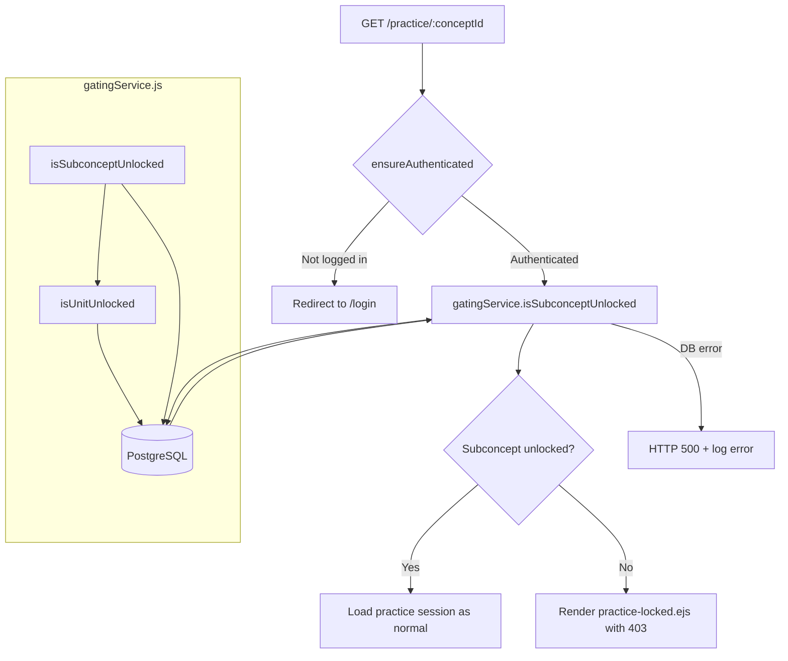

# Design Document: Prerequisite Gating

## Overview

This design adds server-side enforcement of prerequisite gating to the Learn.ai platform. The dashboard already renders locked/unlocked/mastered visual states client-side, but students can bypass the prerequisite sequence by navigating directly to `GET /practice/:conceptId`. This design introduces a `gatingService.js` module that evaluates prerequisite mastery and a guard on the practice route that blocks access to locked subconcepts with an HTTP 403 response.

The gating logic is two-tiered, mirroring the knowledge graph:
1. **Unit-level gating**: A unit (chapter) is unlocked only when every subconcept in all its prerequisite units has mastery ≥ 0.8.
2. **Subconcept-level gating**: A subconcept is unlocked only when its parent unit is unlocked AND all its direct prerequisite subconcepts have mastery ≥ 0.8.

Entry points (units with no prerequisites, subconcepts with no prerequisites in an unlocked unit) are always unlocked for all students, including new students with no mastery data.

## Architecture



The gating check is inserted into the existing practice route handler in `app.js`, between the `ensureAuthenticated` middleware and the question-loading logic. The `gatingService.js` module is a pure query layer — it reads from `chapter_prerequisites`, `concept_prerequisites`, `concepts`, and `user_concept_mastery` but never writes.

## Components and Interfaces

### `services/gatingService.js`

A new ES module exporting two functions:

```javascript
/**
 * Check if a unit (chapter) is unlocked for a given student.
 * A unit is unlocked when:
 *   - It has no rows in chapter_prerequisites (starting unit), OR
 *   - Every subconcept in every prerequisite unit has mastery >= 0.8
 *
 * @param {pg.Client} db - PostgreSQL client
 * @param {number} userId - Student's user ID
 * @param {string} chapterId - The chapter/unit ID to check
 * @returns {Promise<{unlocked: boolean, unmetPrereqs: Array}>}
 */
export async function isUnitUnlocked(db, userId, chapterId)

/**
 * Check if a subconcept is unlocked for a given student.
 * A subconcept is unlocked when:
 *   - Its parent unit is unlocked, AND
 *   - It has no rows in concept_prerequisites (starting subconcept), OR
 *   - Every prerequisite subconcept has mastery >= 0.8
 *
 * @param {pg.Client} db - PostgreSQL client
 * @param {number} userId - Student's user ID
 * @param {string} conceptId - The subconcept ID to check
 * @returns {Promise<{unlocked: boolean, reason: string|null, unmetPrereqs: Array}>}
 */
export async function isSubconceptUnlocked(db, userId, conceptId)
```

The `unmetPrereqs` array in the return value contains objects with `{id, name, mastery}` for each unmet prerequisite, used by the locked view to show the student what they need to master.

### Practice Route Guard (in `app.js`)

The existing `GET /practice/:conceptId` handler is modified to call `isSubconceptUnlocked` before loading questions:

```javascript
import { isSubconceptUnlocked } from './services/gatingService.js';

app.get('/practice/:conceptId', ensureAuthenticated, async (req, res) => {
    try {
        const { conceptId } = req.params;
        const conceptRes = await db.query(
            'SELECT id, name, subject FROM concepts WHERE id=$1', [conceptId]
        );
        if (!conceptRes.rows[0]) return res.status(404).send('Concept not found');

        // --- GATING CHECK ---
        const gateResult = await isSubconceptUnlocked(db, req.user.id, conceptId);
        if (!gateResult.unlocked) {
            return res.status(403).render('practice-locked.ejs', {
                concept: conceptRes.rows[0],
                reason: gateResult.reason,
                unmetPrereqs: gateResult.unmetPrereqs,
                user: req.user
            });
        }
        // --- END GATING CHECK ---

        // ... existing question-loading logic unchanged ...
    } catch (e) {
        console.error('Practice load error:', e);
        res.status(500).send('Failed to load practice session');
    }
});
```

### `views/practice-locked.ejs`

A new EJS template rendered on 403. Shows:
- The subconcept name the student tried to access
- The reason it's locked (unit locked or subconcept prereqs unmet)
- A list of unmet prerequisites with their current mastery percentages
- A link back to the dashboard

### Constants

The mastery threshold is defined as a constant in `gatingService.js`:

```javascript
const MASTERY_THRESHOLD = 0.8;
```

This matches the 0.8 threshold already used in the dashboard's client-side logic (`mastery >= 0.8` checks in `dashboard.ejs`).

## Data Models

No new tables are needed. The gating service reads from existing tables:

### Tables Used

| Table | Role in Gating |
|-------|---------------|
| `chapters` | Look up unit metadata (id, name) |
| `chapter_prerequisites` | Unit → prerequisite unit edges |
| `concepts` | Look up subconcept metadata and `chapter_id` (parent unit) |
| `concept_prerequisites` | Subconcept → prerequisite subconcept edges (including cross-chapter from migration 007) |
| `user_concept_mastery` | Per-student mastery values; `COALESCE(mastery, 0.0)` for students with no data |

### SQL Query: `isUnitUnlocked`

Single round-trip query that checks if all subconcepts in all prerequisite units have mastery ≥ 0.8:

```sql
SELECT cp.prereq_id AS prereq_unit_id,
       ch.name AS prereq_unit_name,
       c.id AS concept_id,
       c.name AS concept_name,
       COALESCE(ucm.mastery, 0.0) AS mastery
FROM chapter_prerequisites cp
JOIN chapters ch ON ch.id = cp.prereq_id
JOIN concepts c ON c.chapter_id = cp.prereq_id
LEFT JOIN user_concept_mastery ucm
       ON ucm.concept_id = c.id AND ucm.user_id = $1
WHERE cp.chapter_id = $2
  AND COALESCE(ucm.mastery, 0.0) < 0.8
ORDER BY ch.name, c.name;
```

- If this returns 0 rows → unit is unlocked (all prereq subconcepts mastered, or no prereqs exist).
- If rows are returned → unit is locked; the rows are the unmet prerequisites.

### SQL Query: `isSubconceptUnlocked`

After confirming the parent unit is unlocked, check subconcept-level prerequisites:

```sql
SELECT cp.prereq_id,
       c.name AS prereq_name,
       COALESCE(ucm.mastery, 0.0) AS mastery
FROM concept_prerequisites cp
JOIN concepts c ON c.id = cp.prereq_id
LEFT JOIN user_concept_mastery ucm
       ON ucm.concept_id = cp.prereq_id AND ucm.user_id = $1
WHERE cp.concept_id = $2
  AND COALESCE(ucm.mastery, 0.0) < 0.8
ORDER BY c.name;
```

- If 0 rows → subconcept prerequisites are met.
- If rows returned → subconcept is locked; rows are the unmet prereqs with mastery values.

### Entry Point Handling

Both queries naturally handle entry points:
- A unit with no rows in `chapter_prerequisites` returns 0 rows from the unit query → unlocked.
- A subconcept with no rows in `concept_prerequisites` returns 0 rows from the subconcept query → unlocked (assuming parent unit is unlocked).
- New students with no `user_concept_mastery` rows get `COALESCE(mastery, 0.0)` which is < 0.8, so prerequisite subconcepts are correctly treated as unmastered. But entry points (no prereqs) are still unlocked.


## Correctness Properties

*A property is a characteristic or behavior that should hold true across all valid executions of a system — essentially, a formal statement about what the system should do. Properties serve as the bridge between human-readable specifications and machine-verifiable correctness guarantees.*

### Property 1: Unit unlock is equivalent to all prerequisite subconcepts being mastered

*For any* unit U and any student S, `isUnitUnlocked(db, S, U)` returns `unlocked: true` if and only if every subconcept belonging to every prerequisite unit of U (via `chapter_prerequisites`) has mastery ≥ 0.8 for student S. When U has no prerequisite units, the result is always `unlocked: true` regardless of the student's mastery data.

**Validates: Requirements 1.1, 1.2, 1.3, 4.1**

### Property 2: Subconcept unlock requires both unit unlock and prerequisite subconcept mastery

*For any* subconcept C and any student S, `isSubconceptUnlocked(db, S, C)` returns `unlocked: true` if and only if (a) C's parent unit is unlocked for S, AND (b) every subconcept listed as a prerequisite of C in `concept_prerequisites` has mastery ≥ 0.8 for S. This holds identically for cross-chapter and within-chapter prerequisite edges. When C has no prerequisite subconcepts and its parent unit is unlocked, the result is always `unlocked: true`.

**Validates: Requirements 2.1, 2.2, 2.3, 2.4, 4.2**

### Property 3: Practice route HTTP status matches gating result

*For any* authenticated student S and any subconcept C, the practice route `GET /practice/:conceptId` returns HTTP 200 if and only if `isSubconceptUnlocked(db, S, C)` returns `unlocked: true`, and returns HTTP 403 with unmet prerequisite details if and only if `isSubconceptUnlocked` returns `unlocked: false`.

**Validates: Requirements 3.1, 3.2, 4.3**

## Error Handling

| Scenario | Behavior |
|----------|----------|
| `conceptId` not found in `concepts` table | Return HTTP 404 (existing behavior, unchanged) |
| Database error during `isUnitUnlocked` or `isSubconceptUnlocked` | Propagate error to practice route catch block → HTTP 500 + `console.error`. Never default to unlocked. |
| Student has no rows in `user_concept_mastery` | `COALESCE(mastery, 0.0)` treats missing mastery as 0.0. Entry points (no prereqs) remain unlocked; non-entry-points remain locked. |
| `concept.chapter_id` is NULL (orphan subconcept) | Treat as unlocked at the unit level (no parent unit to gate). Log a warning. This is a data integrity edge case that shouldn't occur with proper seeding. |
| Invalid `userId` (not in `users` table) | The `ensureAuthenticated` middleware prevents this. The LEFT JOIN on `user_concept_mastery` simply returns no rows. |

## Testing Strategy

### Property-Based Tests

Use [fast-check](https://github.com/dubzzz/fast-check) for property-based testing. Each property test runs a minimum of 100 iterations with randomly generated inputs.

**Test file**: `tests/gatingService.property.test.js`

Tests operate against a real PostgreSQL test database (or an in-memory mock that faithfully reproduces the schema). Each iteration:
1. Seeds random prerequisite graph edges into `chapter_prerequisites` and `concept_prerequisites`
2. Seeds random mastery values into `user_concept_mastery`
3. Calls the gating function
4. Asserts the property holds

Each test is tagged with a comment referencing the design property:
- `// Feature: prerequisite-gating, Property 1: Unit unlock is equivalent to all prerequisite subconcepts being mastered`
- `// Feature: prerequisite-gating, Property 2: Subconcept unlock requires both unit unlock and prerequisite subconcept mastery`
- `// Feature: prerequisite-gating, Property 3: Practice route HTTP status matches gating result`

### Unit Tests

**Test file**: `tests/gatingService.unit.test.js`

Specific examples and edge cases:
- New student (no mastery data) accessing a starting subconcept → unlocked
- Student with all prereqs mastered at exactly 0.8 → unlocked
- Student with one prereq at 0.79 → locked
- Cross-chapter prerequisite (e.g., Math subconcept required for Physics subconcept) → enforced
- Database error during gating → HTTP 500, not default unlocked
- Orphan subconcept with NULL `chapter_id` → treated as unlocked at unit level with warning

### Integration Tests

**Test file**: `tests/practiceRoute.integration.test.js`

End-to-end tests using supertest against the Express app:
- Authenticated student hits locked subconcept → 403 + `practice-locked.ejs` rendered
- Authenticated student hits unlocked subconcept → 200 + `practice.ejs` rendered
- Unauthenticated request → redirect to login (existing behavior)
