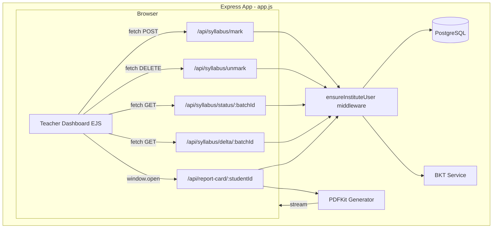

# Design Document: Syllabus Tracker + Parent Report Card

## Overview

This feature adds two capabilities to the existing Teacher Dashboard:

1. **Syllabus Tracker** — Teachers mark NTA chapters as "Taught in Class" per batch. The system computes a delta between teaching progress and batch-level BKT mastery, surfacing warnings when taught chapters aren't being mastered.

2. **Parent Report Card** — A one-click PDF export of a student's mastery data organized by subject → chapter → micro-concept. Teachers and institute admins generate these from the Teacher Dashboard to share with parents.

Both features integrate into the existing monolithic `app.js` Express application, the PostgreSQL database, and the EJS-based Teacher Dashboard at `/institute/dashboard/teacher`. No new microservices are introduced.

### Key Design Decisions

- **Server-side PDF generation with PDFKit**: The project has no existing PDF generation library in `package.json`. We'll use `pdfkit` because it's lightweight, has zero native dependencies (unlike Puppeteer which requires Chromium), and generates PDFs programmatically without HTML rendering overhead.
- **New `chapter_teaching_status` table**: A simple junction table with a unique constraint on `(chapter_id, batch_id)` to track which chapters are taught per batch.
- **Inline AJAX on existing Teacher Dashboard**: The syllabus tracker UI is added directly to the existing `institute-teacher-dashboard.ejs` view. Toggle interactions use `fetch()` calls to avoid page reloads.
- **Delta computation is on-demand**: Batch mastery deltas are computed at page load and when teaching status changes, not stored as materialized data. This keeps the system simple and always reflects current BKT mastery.

## Architecture



### Request Flow — Mark Chapter as Taught

1. Teacher clicks toggle on chapter node in Knowledge Graph
2. Browser sends `POST /api/syllabus/mark` with `{ chapterId, batchId }`
3. Server validates: user is teacher/admin, batch belongs to user's institute
4. Server inserts into `chapter_teaching_status` (or returns conflict if already marked)
5. Server returns the new teaching status record
6. Browser updates the chapter node visual (adds checkmark badge)

### Request Flow — Generate Report Card

1. Teacher clicks "Export Report Card" button next to student name
2. Browser opens `GET /api/report-card/:studentId?batchId=X` in new tab
3. Server validates: user is teacher/admin, student belongs to same institute
4. Server queries `user_concept_mastery` joined with `concepts` and `chapters`
5. Server groups data by subject → chapter → concept, computes averages
6. PDFKit generates PDF with header, subject summary, chapter breakdown, concept details
7. PDF streams directly to browser as download

## Components and Interfaces

### 1. Database Migration (`migrations/009_syllabus_tracker.sql`)

Creates the `chapter_teaching_status` table.

### 2. Syllabus Tracker API Routes (added to `app.js`)

| Method | Route | Auth | Description |
|--------|-------|------|-------------|
| `POST` | `/api/syllabus/mark` | `ensureInstituteUser` | Mark a chapter as taught for a batch |
| `DELETE` | `/api/syllabus/unmark` | `ensureInstituteUser` | Unmark a chapter for a batch |
| `GET` | `/api/syllabus/status/:batchId` | `ensureInstituteUser` | Get all teaching statuses for a batch |
| `GET` | `/api/syllabus/delta/:batchId` | `ensureInstituteUser` | Get taught chapters with batch mastery + warnings |

### 3. Report Card API Route (added to `app.js`)

| Method | Route | Auth | Description |
|--------|-------|------|-------------|
| `GET` | `/api/report-card/:studentId` | `ensureInstituteUser` | Generate and stream PDF report card |

### 4. Report Card Service (`services/reportCardService.js`)

Encapsulates the PDF generation logic:

```javascript
// services/reportCardService.js
export async function compileReportData(db, studentId, instituteId) → ReportData
export function generateReportPDF(reportData) → ReadableStream
```

- `compileReportData`: Queries mastery data, groups by subject/chapter/concept, computes averages. Returns a structured `ReportData` object.
- `generateReportPDF`: Takes compiled data, returns a PDFKit document stream. Handles layout: header with branding, subject summary with color-coded bars, chapter breakdown, concept details.

### 5. Teacher Dashboard UI Updates (`views/institute-teacher-dashboard.ejs`)

- **Chapter toggle**: Each chapter node in the macro graph gets a small checkbox/toggle overlay. Clicking it fires the mark/unmark API.
- **Syllabus Progress panel**: A new card section below the filter bar showing "X / 54 chapters taught" with a progress bar, plus a list of taught chapters sorted by ascending batch mastery, color-coded.
- **Delta Warnings**: Red alert cards at the top of the Syllabus Progress panel for chapters meeting the warning threshold (≥80% of students below 50% mastery).
- **Export Report Card button**: Added next to each student chip in the student selector area.

### Interface Contracts

**POST /api/syllabus/mark**
```json
// Request
{ "chapterId": "phys_kinematics", "batchId": 1 }
// Response 201
{ "chapter_id": "phys_kinematics", "batch_id": 1, "teacher_id": 5, "marked_at": "2024-01-15T10:30:00Z" }
// Response 409 (already marked)
{ "error": "Chapter already marked as taught for this batch" }
// Response 403
{ "error": "Forbidden" }
```

**DELETE /api/syllabus/unmark**
```json
// Request
{ "chapterId": "phys_kinematics", "batchId": 1 }
// Response 200
{ "success": true }
// Response 404
{ "error": "Teaching status not found" }
```

**GET /api/syllabus/status/:batchId**
```json
// Response 200
{
  "batchId": 1,
  "statuses": [
    { "chapter_id": "phys_kinematics", "teacher_id": 5, "marked_at": "2024-01-15T10:30:00Z" }
  ]
}
```

**GET /api/syllabus/delta/:batchId**
```json
// Response 200
{
  "batchId": 1,
  "totalChapters": 54,
  "taughtCount": 12,
  "taughtChapters": [
    {
      "chapter_id": "phys_kinematics",
      "chapter_name": "Kinematics",
      "batch_mastery": 0.35,
      "students_below_50": 0.85,
      "is_warning": true
    }
  ]
}
```

**GET /api/report-card/:studentId**
```
Response: application/pdf stream
Content-Disposition: attachment; filename="{student_name}_report_card_{date}.pdf"
```

## Data Models

### New Table: `chapter_teaching_status`

```sql
CREATE TABLE chapter_teaching_status (
    id SERIAL PRIMARY KEY,
    chapter_id VARCHAR(100) NOT NULL REFERENCES chapters(id) ON DELETE CASCADE,
    batch_id INTEGER NOT NULL REFERENCES batches(id) ON DELETE CASCADE,
    teacher_id INTEGER NOT NULL REFERENCES users(id),
    marked_at TIMESTAMPTZ DEFAULT now(),
    UNIQUE (chapter_id, batch_id)
);

CREATE INDEX idx_teaching_status_batch ON chapter_teaching_status(batch_id);
CREATE INDEX idx_teaching_status_chapter ON chapter_teaching_status(chapter_id);
```

### Existing Tables Used (no modifications)

- `chapters` — 54 NTA chapters with `id`, `name`, `subject`, `display_order`
- `concepts` — ~221 micro-concepts with `chapter_id` FK to chapters
- `user_concept_mastery` — per-student, per-concept mastery (0-1 scale)
- `batches` / `batch_students` — batch membership
- `users` — user roles and institute_id

### Report Data Structure (in-memory)

```typescript
interface ReportData {
  studentName: string;
  instituteName: string;
  generatedAt: Date;
  subjects: {
    name: string;
    overallMastery: number;
    chapters: {
      id: string;
      name: string;
      mastery: number;
      concepts: {
        id: string;
        name: string;
        mastery: number;
      }[];
    }[];
  }[];
}
```

### Delta Computation Query

The batch mastery delta for a taught chapter is computed by:

1. Getting all students in the batch via `batch_students`
2. For each taught chapter, getting all concepts via `concepts WHERE chapter_id = ?`
3. For each student, averaging their `user_concept_mastery.mastery` across those concepts (defaulting to 0.2 for missing records)
4. Computing the batch average and the percentage of students below 50%

This is done in a single SQL query joining `chapter_teaching_status`, `batch_students`, `concepts`, and `user_concept_mastery`.


## Correctness Properties

*A property is a characteristic or behavior that should hold true across all valid executions of a system — essentially, a formal statement about what the system should do. Properties serve as the bridge between human-readable specifications and machine-verifiable correctness guarantees.*

### Property 1: Mark/Unmark Teaching Status Round-Trip

*For any* valid chapter and batch combination, marking the chapter as taught and then querying the teaching status should return a record containing that chapter_id, batch_id, the teacher_id who marked it, and a timestamp. Subsequently unmarking it and querying again should return no record for that combination.

**Validates: Requirements 1.1, 1.2, 1.3**

### Property 2: Unique Constraint on Teaching Status

*For any* chapter and batch that is already marked as taught, attempting to mark it again should be rejected (HTTP 409 or database constraint violation), and exactly one teaching status record should exist for that (chapter_id, batch_id) pair.

**Validates: Requirements 1.4**

### Property 3: Cross-Institute Syllabus Access Rejection

*For any* teacher belonging to institute A and any batch belonging to institute B (where A ≠ B), attempting to mark or unmark a chapter for that batch should return a 403 Forbidden response, and no teaching status record should be created.

**Validates: Requirements 1.5**

### Property 4: Taught Count Consistency

*For any* batch, the `taughtCount` returned by the delta endpoint should equal the number of `chapter_teaching_status` records for that batch, and `totalChapters` should equal the total number of chapters in the system.

**Validates: Requirements 3.1**

### Property 5: Batch Mastery Computation

*For any* batch with N students and a taught chapter with M micro-concepts, the computed batch mastery for that chapter should equal the average across all N students of each student's average mastery across the M concepts (using 0.2 as default for missing mastery records).

**Validates: Requirements 3.2**

### Property 6: Mastery Color-Coding Thresholds

*For any* mastery value m in [0, 1], the color classification should be: green if m ≥ 0.8, yellow if 0.5 ≤ m < 0.8, red if m < 0.5.

**Validates: Requirements 3.3**

### Property 7: Taught Chapters Sorted by Ascending Mastery

*For any* list of taught chapters returned by the delta endpoint, for all consecutive pairs (chapter[i], chapter[i+1]), it should hold that chapter[i].batch_mastery ≤ chapter[i+1].batch_mastery.

**Validates: Requirements 3.4**

### Property 8: Delta Warning Threshold

*For any* taught chapter in a batch, the `is_warning` flag should be true if and only if the proportion of students in the batch with chapter-level mastery below 0.5 is greater than or equal to 0.8.

**Validates: Requirements 4.1, 4.4**

### Property 9: Report Data Completeness

*For any* student in the system, the compiled report data should contain an entry for every micro-concept (using 0.2 mastery for concepts with no mastery record), the student's name, the institute name, and a generation date.

**Validates: Requirements 5.1, 5.5, 5.6**

### Property 10: Chapter Mastery is Average of Concept Masteries

*For any* chapter in the report data, the chapter's mastery value should equal the arithmetic mean of its constituent micro-concept mastery values.

**Validates: Requirements 5.2**

### Property 11: Chapters Ordered by Subject and Display Order

*For any* report data, chapters within each subject group should appear in ascending `display_order`. Subjects should be grouped (Physics, Chemistry, Mathematics).

**Validates: Requirements 5.3**

### Property 12: Subject Mastery is Average of Chapter Masteries

*For any* subject in the report data, the subject's overall mastery should equal the arithmetic mean of all chapter mastery values within that subject.

**Validates: Requirements 5.4**

### Property 13: PDF Generation Produces Valid Output

*For any* valid ReportData object (with at least one subject, one chapter, and one concept), the PDF generator should produce a non-empty Buffer that starts with the PDF magic bytes `%PDF`.

**Validates: Requirements 6.1**

### Property 14: Report Filename Format

*For any* student name and generation date, the report filename should match the pattern `{sanitized_name}_report_card_{YYYY-MM-DD}.pdf` where sanitized_name replaces spaces with underscores and removes special characters.

**Validates: Requirements 6.6**

### Property 15: Report Access Control

*For any* user with a role other than 'teacher' or 'institute_admin', requesting a report card should return 403. *For any* teacher/admin from institute A requesting a report for a student from institute B (A ≠ B), the request should return 403.

**Validates: Requirements 7.1, 7.2, 7.3, 7.4**

## Error Handling

| Scenario | Handling |
|----------|----------|
| BKT service unavailable during delta computation | Return delta data with `bktUnavailable: true` flag; UI shows "mastery data may be stale" warning. Use cached mastery from `user_concept_mastery` table (which is always populated). |
| PDF generation fails (PDFKit error) | Catch error, return HTTP 500 with JSON `{ error: "Failed to generate report card. Please try again." }`. Log the error server-side. Do not crash the process. |
| Student has zero mastery records | Use BKT prior of 0.2 for all concepts. Report still generates with all concepts showing 20% mastery. |
| Invalid chapter_id or batch_id in mark/unmark | Return HTTP 400 with descriptive error. Database FK constraints prevent orphaned records. |
| Concurrent mark requests for same chapter+batch | The UNIQUE constraint on `(chapter_id, batch_id)` causes the second INSERT to fail. Return HTTP 409 Conflict. |
| Teacher removed from institute mid-session | The `ensureInstituteUser` middleware checks `institute_id` on every request. Stale sessions are caught. |
| Very large batch (100+ students) for delta | The delta query uses a single aggregated SQL query with GROUP BY rather than N+1 queries. Performance is O(1) in number of API calls. |

## Testing Strategy

### Property-Based Testing

Use `fast-check` as the property-based testing library (JavaScript). Each property test runs a minimum of 100 iterations.

Property tests focus on:
- **Data computation correctness**: Batch mastery averaging (Property 5), chapter mastery averaging (Property 10), subject mastery averaging (Property 12), warning threshold logic (Property 8)
- **Round-trip operations**: Mark/unmark teaching status (Property 1)
- **Invariants**: Sorting order (Property 7), color thresholds (Property 6), unique constraints (Property 2)
- **Access control**: Cross-institute rejection (Properties 3, 15)
- **Output validity**: PDF generation (Property 13), filename format (Property 14)

Each test must be tagged with: `Feature: syllabus-tracker-parent-report, Property {number}: {title}`

### Unit Testing

Unit tests complement property tests for specific examples and edge cases:

- **Edge cases**: Empty batch (0 students), student with no mastery data, chapter with no concepts, all students at exactly 50% mastery (boundary), batch with exactly 80% of students below threshold
- **Integration points**: API route handler responses (status codes, headers), PDF Content-Disposition header, middleware chain (auth → institute check → handler)
- **Specific examples**: Mark a known chapter for a known batch and verify the exact response shape, generate a report for a student with known mastery values and verify the PDF is non-empty

### Test File Organization

```
tests/
  reportCard.property.test.js    — Property tests for report data compilation and PDF generation
  syllabusTracker.property.test.js — Property tests for mark/unmark, delta, warnings
  reportCard.unit.test.js         — Unit tests for edge cases and integration
  syllabusTracker.unit.test.js    — Unit tests for edge cases and integration
```

### Testing Dependencies

- `fast-check` — Property-based testing library
- `vitest` or `jest` — Test runner (use whichever is already configured, or add `vitest`)
- Tests should mock the database (`db.query`) to isolate logic from PostgreSQL
- PDF tests verify the output buffer starts with `%PDF` magic bytes
